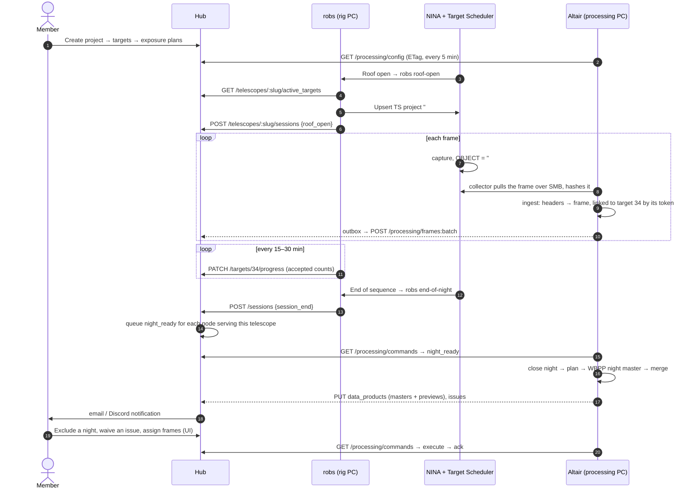
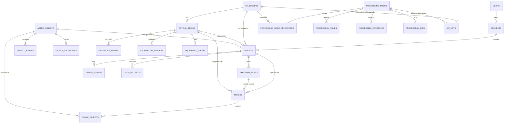

# Altair Observatory System: Architecture

**Describes:** the `altair-observatory-system` repository as of 2026-09-25 (contract
`api_revision` 2). Where the design and the code differ, the difference is listed as work
in §9.
**Not yet deployed:** no component has run on real equipment. §9 lists what has to happen
before the first real night.
**History:** the plan that produced this repository is archived in
[`archive/2026-09-integration-plan.md`](archive/2026-09-integration-plan.md). The Hub's
earlier design and worker contract is archived in
[`archive/2026-09-hub-worker-design.md`](archive/2026-09-hub-worker-design.md).

The system runs a shared remote observatory. Members plan imaging projects in one web app.
The observatory's rigs capture them with NINA. The frames are collected, archived and
processed into masters automatically, and all of it is tracked in one central database.

| Component | Directory | Package | Runs on | Role |
|---|---|---|---|---|
| **Hub** | `hub/` | Rails 8 app | A server (Kamal) | The system of record (PostgreSQL). All human-facing UI and all APIs. |
| **Rig agent** | `rig-agent/` | `robs` (Python) | Each rig PC | Syncs Hub targets into NINA's Target Scheduler, and reports acquisition progress, session events and heartbeats. |
| **Processing core** | `processing/` | `altair` (Python) | The processing PC | Collects, archives and processes frames in the context of Hub targets. Reports frames, nights, masters and issues to the Hub. Only its Hub integration is built so far (§8.2). |
| **Contract** | `contracts/` | `observatory-contracts` | — | JSON Schemas for every API request and response, plus generated pydantic models. The only thing the components share. |

Paths in §7 and §8 are **relative to their component**: `app/models/…` means
`hub/app/models/…`, `src/altair/…` means `processing/src/altair/…`, and `src/robs/…`
means `rig-agent/src/robs/…`.

---

## 0. Design principles

1. **One system of record.** The Hub's PostgreSQL database holds all shared, user-visible
   state: users, telescopes, optical trains, filters, the object catalogue, projects,
   targets, exposure plans, frames (as metadata), nights, data products, processing
   issues and commands. The other components read and write it **only through the Hub's
   HTTP API**. Nothing else connects to Postgres.
2. **Local stores are caches and journals.** Altair keeps a SQLite catalog so that
   collection and processing keep working when the Hub or the internet is down. The rig
   agent keeps a small id-mapping database. Altair reports everything user-visible through
   a transactional **outbox**, and takes intent (targets, settings, commands) **from** the
   Hub.
3. **Project → Target → ExposurePlan.** A `Project` belongs to a member. A `Target` is one
   pointing on one telescope and optical train. An `ExposurePlan` is filter × exposure ×
   count. An Altair processing project is exactly one Hub target on one rig.
4. **Frames are identified by SHA-256** everywhere, so every report is an idempotent
   upsert and the Hub and Altair can always be reconciled.
5. **The NINA `OBJECT` header carries the Hub target id** (`#<id> <name>`). Altair links
   frames by that token first, then by name plus coordinates. It never processes a frame
   into a guessed project: frames it can't resolve wait for a person to assign them.
6. **One data pipeline.** Altair is the only component that moves, uploads or stacks
   image data. The rig agent only schedules and reports.
7. **One UI stack:** Hotwire (Turbo + Stimulus), Tailwind and Chart.js. Visibility maths
   runs server-side in Ruby.
8. **Hub → Altair control is a command queue** that Altair polls. The web UI can drive
   processing without any inbound port on the observatory network.
9. **One repository, independent components.** Each component has its own dependencies,
   tests and CI, runs without the others, and never imports another component's code.
   All communication between components goes through the Hub API. The only direct path
   between machines is Altair pulling image files from the rig PCs over SMB.

---

## 1. Goals and non-goals

### 1.1 Goals

- A member defines a **project** once in the Hub (catalogue objects, telescope, exposure
  plans) and sees its whole life in one place: scheduling, acquisition, archive,
  processing and results.
- **Progress** shows three honest numbers per exposure plan: *acquired* (Target Scheduler
  accepted the frame), *collected* (safely archived) and *integrated* (in the latest
  master).
- The catalogue, altitude and best-season charts, "well placed tonight" and file search
  work for every observatory telescope, using that telescope's real horizon.
- Altair works **in terms of Hub target and project ids**: its projects, CLI, issues and
  outputs are all addressable by them.
- Every component keeps working when another is down, and catches up afterwards without
  losing or double-counting anything.

### 1.2 Non-goals

- Bulk image data in the Hub. The Hub stores metadata, previews and archive pointers. Raw
  frames and masters stay on the NAS and in S3, owned by Altair.
- Direct database connections from observatory machines.
- Members' personal telescopes. Every telescope is admin-managed, scheduled through a rig
  agent and processed by Altair.
- Combining data from different optical trains into one master.
- Offline mobile use, and mosaic assembly (future work, §13).

---

## 2. Where the pieces came from

The monorepo merged three repositories with their full histories. A fourth was retired
and its features rebuilt in the Hub.

| Former repository | Now | Notes |
|---|---|---|
| `remote-observatory-queueing-system` | `hub/` | Extended into the Hub. Its earlier design doc is archived. |
| `remote-observatory-worker` | `rig-agent/` | Gained Hub-driven project sync, session events and heartbeats. |
| `altair-pre-processor` | `processing/` | The spec (`processing/docs/SPEC.md`, now v0.8) plus the Hub integration code. |
| `astrophotography-database` | Not merged in (§8.4) | Its catalogue, visibility, project and file-search features are in the Hub, and its FITS indexer is `altair index`. A one-off import brings over existing data. |

The three merged repositories carry README banners pointing here. Archiving them, and the
final release of `astrophotography-database`, are still to do (§9.1).

---

## 3. Architecture

### 3.1 Deployment topology

```mermaid
flowchart LR
  subgraph Cloud["Hub host (cloud or club server)"]
    HUB["Rails Hub<br/>Puma + Solid Queue + Solid Cable"]
    PG[("PostgreSQL<br/>system of record")]
    AS[("Active Storage<br/>previews, showcases, horizon files")]
    HUB --- PG
    HUB --- AS
  end

  subgraph Obs["Observatory LAN"]
    subgraph Rig["Rig PC (one per telescope)"]
      NINA["NINA + Target Scheduler"]
      W["robs"]
      W <--> NINA
    end
    subgraph Proc["Processing PC"]
      ALT["Altair<br/>hub sync (built)<br/>collector, planner, executor (spec)"]
      PI["PixInsight / WBPP"]
      SQL[("Altair SQLite catalog")]
      ALT --- PI
      ALT --- SQL
    end
    NAS[("NAS")]
  end

  S3[("S3 archive bucket")]

  Browser(("Members & admins")) -->|HTTPS| HUB
  W -->|"HTTPS /api/v1 (telescope key)"| HUB
  ALT -->|"HTTPS /api/v1/processing (node key)"| HUB
  ALT -->|SMB pull| Rig
  ALT <-->|SMB| NAS
  ALT <-->|HTTPS| S3
```



All traffic from the observatory is **outbound**: the rig agent and Altair call the Hub,
and the Hub never calls into the LAN. The observatory needs no inbound firewall rules, and
the Hub can be hosted anywhere.

### 3.2 Component responsibilities

| Component | Owns | Reads from the Hub | Writes to the Hub |
|---|---|---|---|
| **Hub** | Users, auth, telescopes, optical trains, filters, catalogue, projects, targets, exposure plans, processing settings, frame metadata, nights, data products, issues, commands, notifications, all UI | — | — |
| **Rig agent** | Target Scheduler rows for Hub targets, and a local id map | `active_targets` | Accepted counts, session events (roof open/close, session end), heartbeat |
| **Altair** | Everything about files: blobs, replicas, collection, NAS/S3, calibration, jobs, masters, local issue state | Processing config (telescopes, optical trains, filters, targets and aliases, settings, equipment events), commands | Frames, nights, calibration masters, data products and previews, issues, job summaries, heartbeat |

### 3.3 Data ownership

"System of record" means: when two copies disagree, this one wins.

| Data | System of record | Copies |
|---|---|---|
| Users, roles, notification preferences | Hub | — |
| Telescopes (site, timezone, horizon), optical trains, filter lists | Hub | Altair config cache; rig agent (slug and timezone) |
| Object catalogue, aliases, showcases | Hub | Altair's target-alias cache |
| Projects, targets, exposure plans, processing settings | Hub | Target Scheduler (via the rig agent), Altair config cache |
| Acquired (accepted) counts | Target Scheduler, via the rig agent | `exposure_plans.completed_count` |
| Frame identity, headers, night, target link, quality, status | **Altair** (it reads the files) | Hub `frames` (a projection) |
| Manual frame → target assignment | **Hub** (a person decided) | Altair, via the `assign_frames` command (`assignment_source = manual`) |
| Replicas, storage locations, fetches, cleanup | Altair | A per-frame storage summary in the Hub |
| Calibration masters, night and multi-night masters, jobs | Altair | Hub `calibration_masters`, `data_products`, `processing_jobs` |
| Processing issue state | Altair (it detects and auto-resolves them) | Hub `processing_issues` |
| Waive, include/exclude, rerun and re-reference decisions; equipment events | Hub | Altair, via commands |
| Preview JPEGs | Hub Active Storage | — |
| Bulk image data | NAS and S3 (Altair) | — |

### 3.4 Key concepts and identifiers

| Concept | Definition | Identifier |
|---|---|---|
| **Telescope** | An observatory telescope: latitude, longitude, elevation, timezone, horizon mask. Run by one rig agent. | `telescopes.slug` |
| **Optical train** | Telescope + camera (+ reducer) as used for imaging: focal length, pixel size, sensor size, rotator, filter set. **One optical train = one Altair rig.** | `optical_trains.key` = the Altair rig name |
| **Project** | A member's imaging goal: targets, priority, status, visibility, completion basis, processing settings. | `projects.id`. Target Scheduler name `#P<id> <name>` |
| **Target** | One pointing (catalogue object or custom coordinates, optional rotation) on one telescope and optical train, with exposure plans. The unit that is scheduled and processed. | `targets.id`. NINA name `#<id> <name>` |
| **Exposure plan** | Filter × exposure × desired count for a target. | `exposure_plans.id` |
| **Processing project** (Altair) | One target on one rig: its reference frame and multi-night masters. | Altair `projects`, unique on (`hub_target_id`, `rig`) |
| **Night** | The local noon-to-noon window in the **telescope's** timezone, named by the date it starts. | `YYYY-MM-DD` + optical train |
| **Frame** | One captured file (light or calibration). | SHA-256 |
| **Data product** | A result: night master, multi-night master version, project reference, or provisional (no-flat) master. | Hub `data_products.id`; Altair (node, kind, `altair_id`) |
| **Processing node** | One Altair installation, serving one or more telescopes. | `processing_nodes.name` |

### 3.5 A night, end to end

This is the designed flow. Every step on the Hub and rig-agent side is built. On the Altair
side, the collector, planner and PixInsight steps are specified but not built (§8.2.1);
their Hub reporting is built and tested with synthetic data.



### 3.6 Repository

#### 3.6.1 Layout

```
altair-observatory-system/
├── hub/                    Rails 8 app: app/ config/ db/ spec/ script/perf/, Gemfile, package.json, Dockerfile, config/deploy.yml (Kamal)
├── rig-agent/              Python package robs: src/robs/ tests/ config/, pyproject.toml + uv.lock
├── processing/             Python package altair: src/altair/ tests/ docs/SPEC.md, pyproject.toml + uv.lock
├── contracts/
│   ├── schemas/            JSON Schema 2020-12: worker/, processing/, shared/
│   ├── examples/           An example payload per schema, validated in CI
│   ├── python/             observatory-contracts: pydantic models generated from schemas/, command payload types
│   └── CHANGELOG.md        api_revision history
├── docs/
│   ├── SYSTEM_ARCHITECTURE.md   this document
│   └── archive/            superseded plans and designs
├── tools/
│   ├── validate_contracts.py    schemas valid, examples validate, every schema has an example
│   ├── generate_contracts.py    regenerate the pydantic models (--check in CI)
│   └── e2e/                altair_hub_e2e.py, worker_hub_e2e.py (run against a live Hub)
├── .github/workflows/      hub.yml, rig-agent.yml, processing.yml, contracts.yml
├── CLAUDE.md
└── README.md
```

#### 3.6.2 Independence rules and CI

| Rule | How it is enforced |
|---|---|
| No component imports another's code. | import-linter contracts in `rig-agent/pyproject.toml` (no `altair`, no `hub`) and `processing/pyproject.toml` (no `robs`, no `hub`), run in CI. A `hub.yml` step fails if anything under `hub/` outside `spec/` references another component. |
| The only shared code is `contracts/`. | Both Python components depend on `contracts/python` as a path dependency. The Hub reads `contracts/schemas/` **only in specs** (`spec/support/api_contract.rb`), so its Docker build context stays `hub/`. |
| Each component has its own manifest and lockfile. | `hub/Gemfile.lock` + `hub/bun.lock`, `rig-agent/uv.lock`, `processing/uv.lock`. There is no root-level manifest. |
| Each component has its own CI. | Path-filtered workflows. **hub.yml**: Brakeman, bundler-audit, the independence check, RuboCop, and RSpec with Postgres (including the contract specs). **rig-agent.yml**: import-linter and pytest. **processing.yml**: import-linter and pytest on Linux and Windows. **contracts.yml**: schema validation, a codegen drift check, and the contracts package tests. A change under `contracts/` runs every suite. |
| Each component is released and deployed on its own. | The Hub deploys with Kamal from `hub/`. Rig PCs and the processing PC upgrade on their own schedule. Release tags (`hub-v…`, `rig-agent-v…`, `processing-v…`) and packaging are not set up yet (§9.5). |
| API changes are additive. | New fields are optional and clients ignore unknown ones. `contracts/CHANGELOG.md` records each `api_revision`. A breaking change would ship as `/api/v2` alongside v1. |

#### 3.6.3 Standalone operation

| Component | Without the others it… | Configuration |
|---|---|---|
| **Hub** | Serves the catalogue, projects, targets, visibility, wizard and admin. Frames, progress and masters stay empty until agents report. | Default. |
| **Rig agent** | Reads targets from a local file in the `active_targets` schema, syncs them into Target Scheduler, and writes progress and session events to a local JSON-lines log. At session end it writes Altair's marker file instead of calling the Hub. | `hub.enabled: false` + `targets_file:` |
| **Altair** | Uses its YAML aliases and text-target projects, and closes nights from the session-end marker file or quiescence (SPEC v0.7 behaviour). | `hub.enabled: false`, `require_target_link: false` |

With the Hub in use, the session-end signal goes through the API: the rig agent posts
`session_end`, and the Hub queues a `night_ready` command for every node serving that
telescope (§5.4). The marker file is used only when there is no Hub.

#### 3.6.4 History

`git subtree add` merged each repository under its directory without squashing. To follow a
file's history from before the merge, use the merge commit's second parent (see the root
README).

---

## 4. Domain model (Hub, PostgreSQL)

### 4.1 Entity relationships



### 4.2 Tables

`hub/db/schema.rb` is authoritative. This is a summary.

| Table | Key columns |
|---|---|
| `users` | Devise auth, `role` (member / admin), `notify_email`, `notify_discord`, `discord_webhook_url`, `sjaa_membership_number` |
| `telescopes` | `slug`, `name`, `latitude`, `longitude`, `elevation_m`, **`timezone`**, `min_altitude_deg`, `default_optical_train_id`, `active`, `self_serve_submit`, `worker_last_heartbeat_at`, `worker_status`; `horizon_file` attachment |
| `optical_trains` | `telescope_id`, `key` (unique per telescope, = Altair rig), `camera_name`, `camera_type` (mono / osc), `bayer_pattern`, `pixel_size_um`, `sensor_width_px`, `sensor_height_px`, `focal_length_mm`, `has_rotator`, `filters` jsonb (`[{name, aliases}]`), `header_aliases` jsonb, `active`. A train missing optics is left out of the processing config. |
| `astro_objects` | `primary_name`, `ra_deg`, `dec_deg`, `object_type`, `magnitude`, sizes, `position_angle_deg`, `constellation`, `source` (openngc / ldn / lbn / telescopius / custom), `source_ref`, `created_by_id`. Trigram index on the name. |
| `object_aliases` | `astro_object_id`, `name`, `normalized_name` (trigram + btree), `catalog` |
| `object_showcases` | `astro_object_id`, `source_type` (upload / product / survey), `data_product_id`, `survey_name`, `image` attachment |
| `projects` | `user_id`, `name`, `description`, `status` (planning / active / paused / completed / archived), `priority`, `visibility` (private / club), `completion_basis` (acquired / integrated), `processing_settings` jsonb |
| `targets` | `project_id`, `user_id` (= the project's owner), `telescope_id`, `optical_train_id`, `astro_object_id` (null for custom coordinates), `name`, `ra_deg`, `dec_deg`, `rotation_deg`, `panel`, `is_primary`, `min_altitude_deg`, `priority`, `status`, `processing_settings` jsonb, `schedule_count_basis`, `submitted_at`, `notes` |
| `exposure_plans` | `target_id`, `filter`, `exposure_seconds`, `desired_count`, counters `completed_count` (acquired), `collected_count`, `usable_count`, `integrated_count`, `integrated_seconds` (§4.3) |
| `target_events` | `target_id`, `event_type`, `payload`. Drives notifications. |
| `frames` | `sha256` (unique), `processing_node_id`, `altair_frame_id`, `telescope_id`, `optical_train_id`, `target_id`, `project_id`, `exposure_plan_id`, `assignment_source` (header_token / name / coords / manual / unlinked), `image_type`, `night`, `date_obs`, `object_header`, `filter`, `filter_known`, exposure / gain / offset / binning / readout / temperature, rotator, `ra_deg`, `dec_deg`, `rotation_deg`, size and FOV, `file_name`, `logical_path`, `status`, `status_reason`, `quality` jsonb, `storage` jsonb, `headers` jsonb, `origin` (collect / import / legacy_index), `fov_matched_at`. Indexed for the searches in §7.3, including a trigram index on `file_name`. |
| `frame_objects` | `frame_id`, `astro_object_id`, `association_type` (primary / in_fov), `angular_distance_arcmin` |
| `observing_nights` | `telescope_id`, `optical_train_id`, `night`, `state` (open / closing / closed), `closed_by`, roof and session-end times, `lights_count`, `calibration_count`, `light_seconds`, `manifest_sha256` |
| `calibration_masters` | Projection: `processing_node_id`, `altair_id`, `optical_train_id`, `kind`, filter, exposure, gain, offset, binning, temperature, rotator, `night`, `n_frames`, `sha256`, `superseded` |
| `equipment_events` | `optical_train_id`, `at`, `kind` (sensor_cleaned, filter_changed, …), `filter`, `note`, `created_by_id`, `altair_synced_at` |
| `data_products` | Was `target_files`. `target_id`, `project_id`, `optical_train_id`, `processing_node_id`, `altair_id`, `kind` (`night_master`, `multi_night_master`, `project_reference`, `provisional_noflat`), `night`, `filter`, `version`, `sha256`, `size_bytes`, `archive_uri`, `nas_path`, `metrics` jsonb, `superseded_by_id`; `preview` and `thumbnail` attachments |
| `processing_nodes` | `name` (unique), `description`, `active`, `last_heartbeat_at`, `status` jsonb (versions, outbox depth, …) |
| `processing_node_telescopes` | Which telescopes a node serves |
| `processing_issues` | `processing_node_id`, `fingerprint` (unique per node), `altair_id`, `kind`, `severity` (blocking / warning / info), `status` (open / resolved / waived), `message`, `requirement`, `scope`, optional telescope / train / project / target / night / filter, `opened_at`, `resolved_at`, `resolution`, `last_notified_at` |
| `processing_jobs` | Summary only: node, `altair_id`, `kind`, `status`, target, night, filter, times, `error` |
| `processing_commands` | `processing_node_id`, `kind`, `payload`, `target_id`, `requested_by_id`, `state` (pending / delivered / succeeded / failed / cancelled), `result`, `delivered_at`, `completed_at` |
| `api_keys` | Polymorphic `owner` (Telescope or ProcessingNode), `name`, `token_digest` (SHA-256), `scopes`, `active`, `last_used_at` |

Visibility results are not stored in tables. They are cached in `Rails.cache` (Solid Cache).

### 4.3 Progress model

Each exposure plan has four counters, and each counter has exactly one writer:

| Counter | Meaning | Written by |
|---|---|---|
| `completed_count` (**acquired**) | Frames Target Scheduler accepted | The rig agent (`PATCH /targets/:id/progress`, set, not increment) |
| `collected_count` | Lights archived, linked to this plan, not invalid | The Hub, recomputed from `frames` |
| `usable_count` | Lights used in a final night master | The Hub, from data product metrics and frame status |
| `integrated_count` / `integrated_seconds` | Lights and seconds in the latest multi-night master for this filter | The Hub, from the latest `multi_night_master` |

The Hub recomputes its counters after frame batches and data products (debounced per
target, `ProgressRecomputeJob`), and for every active target daily.

**Frame → plan matching** (`Frames::PlanMatcher`): same target, same canonical filter,
and `|exposure_s − plan.exposure_seconds| ≤ 0.5 s`. A light that matches no plan still
counts in the project's per-filter totals as unplanned.

**Project progress** (`Progress::Calculator`): the goal in seconds per filter is Σ
`exposure_seconds × desired_count` over the project's targets. For each basis the page
shows actual seconds per filter, a percentage per filter (capped at 100), and an overall
percentage (the mean across goal filters).

**Completion** depends on `projects.completion_basis`:

- `acquired` (the default): a target completes when every plan's `completed_count ≥
  desired_count`.
- `integrated`: a target completes when every plan's `integrated_count ≥ desired_count`.
  To replace frames Altair rejected, `active_targets` sends a per-plan `schedule_count` =
  `desired_count + max(0, completed_count − usable_count)`, counted over processed nights.
  The rig agent writes `schedule_count` into Target Scheduler. With `acquired`,
  `schedule_count == desired_count`.

### 4.4 Naming and time contract

- **NINA target name** = `#<target_id> <name>` (`Target#nina_name`, sent as `nina_name`).
  NINA writes it into `OBJECT`.
- **Target Scheduler project name** = `#P<project_id> <name>`.
- **Header token** (Altair): `^#(\d+)(\s|$)`.
- **Night** = `(date_obs in the telescope timezone − 12 h).date`. The Hub telescope's
  timezone, the rig agent's `timezone` and Altair's site timezone must agree;
  `robs check-config` and `altair doctor` check it.
- **Canonical filter names** come from `optical_trains.filters[].name`. Raw `FILTER` values
  map onto them case-insensitively, then through the aliases.
- **Altair logical paths** for linked projects are anchored by the target id
  (`projects/<rig>/T<target_id>_<slug>/…`), so renaming a target never renames archived
  paths.

---

## 5. Hub API (`/api/v1`, api_revision 2)

The machine-readable contract is `contracts/schemas/`, with examples in
`contracts/examples/`. Hub request specs validate every response and example request
against it (`match_api_contract`). The Python components build their payloads from the
generated `observatory-contracts` models.

### 5.1 Authentication and scopes

- `Authorization: Bearer <token>` or `X-Api-Key`. Only SHA-256 digests are stored.
- A key belongs to a **Telescope** (rig agent) or a **ProcessingNode** (Altair) and carries
  scopes, checked per action (`require_scope`):

| Scope | Rig agent | Altair | Grants |
|---|---|---|---|
| `targets:read` | ✓ | ✓ | `active_targets`, processing config |
| `progress:write` | ✓ | | `PATCH /targets/:id/progress` |
| `events:write` | ✓ | ✓ | `POST /targets/:id/events` |
| `sessions:write` | ✓ | | Session events |
| `frames:write` | | ✓ | Frames, nights, calibration masters |
| `products:write` | | ✓ | Data products and previews |
| `issues:write` | | ✓ | Issues, jobs |
| `commands:read` | | ✓ | Command poll and ack |
| `heartbeat:write` | ✓ | ✓ | Heartbeat |

- **Resource scoping:** a telescope key touches only its own telescope's targets. A node
  key touches only the telescopes it serves, and the targets, frames, nights, issues and
  products under them.
- **Rate limit:** 600 requests per minute per key. Preview uploads are JPEG only, at most
  10 MB.

### 5.2 Rig agent endpoints

| Endpoint | Purpose |
|---|---|
| `GET /telescopes/:slug/active_targets` | The telescope (with `timezone`) and its schedulable targets: coordinates, `nina_name`, `rotation_deg`, `min_altitude_deg`, `project` (id, name, priority, `ts_project_name`), `optical_train.key`, and exposure plans with `completed_count`, `remaining_count` and `schedule_count`. The effective Target Scheduler priority is the project's. |
| `PATCH /targets/:id/progress` | Sets `completed_count` per plan. Completion follows `completion_basis`. |
| `POST /targets/:id/events` | A target event (notifications). |
| `POST /telescopes/:slug/sessions` | `{event: roof_open \| roof_close \| session_end, at, night, target_ids}`. Updates `observing_nights` and emits `session` events. `session_end` queues `night_ready` for each optical train of the telescope on each node that serves it. |
| `POST /heartbeat` | `{agent, version, api_revision, status}`. Both principals. The response carries the Hub's `api_revision`. |

### 5.3 Processing endpoints (`/api/v1/processing`)

| Endpoint | Purpose |
|---|---|
| `GET /config` | The node's world, with an `ETag` (`304` when unchanged): `api_revision`, the node, its telescopes with site and optical trains (optics, filters, header aliases), every non-draft target on them (including completed and cancelled ones, so late frames still resolve) with aliases and merged `processing_settings`, and equipment events. |
| `POST /frames:batch` | Up to 500 frames, **upserted by `sha256`**. Each item succeeds or fails on its own. A frame is never rejected for an unknown target: it is stored with `target_id = null` and appears in the unassigned inbox. Once a frame's assignment is `manual` in the Hub, Altair can't change it; the response returns the manual `target_id` and Altair adopts it. Afterwards the Hub matches plans, debounces the counter recompute, queues the FOV match and emits at most one `frames_collected` event per (target, night, filter) per hour. |
| `PATCH /frames:batch` | Partial updates by `sha256`: `status`, `status_reason`, `quality`, `storage`. |
| `PUT /nights/:optical_train/:night` | Night state, counts, `closed_by`, `manifest_sha256`. |
| `GET /nights/:optical_train/:night/digest` | `{frame_count, sha256_xor, by_type}` for reconciliation. |
| `PUT /calibration_masters/:altair_id` | Projection upsert. |
| `PUT /data_products/:kind/:altair_id` | Multipart: `metadata` JSON plus optional `preview` and `thumbnail` JPEGs. Emits `master_updated` and updates counters. |
| `PUT /issues/:fingerprint` | Issue upsert. Transitions emit `issue_opened` / `issue_resolved` (routing in §7.4). |
| `PUT /jobs/:altair_id` | Job summary upsert. |
| `GET /commands` | Pending commands (marked delivered). |
| `POST /commands/:id/ack` | `{state: succeeded \| failed, result}`. |

Routes with a literal colon (`frames:batch`) are declared as a glob segment with a
constraint in `config/routes.rb`.

### 5.4 Commands (Hub → Altair)

Each command runs the same code path as the matching Altair CLI command. Commands are
idempotent by id: Altair records executed ids in `hub_commands` and re-acks a repeat
without running it again.

| Kind | Payload | Issued from | Handled in Altair today |
|---|---|---|---|
| `assign_frames` | `{sha256s \| selector, target_id}` | Unassigned inbox, frame search bulk action | Relinks the frames, resolves `PROJECT_UNRESOLVED` |
| `night_ready` | `{optical_train, night, at, closed_by}` | Automatically, on `session_end` | Closes the night |
| `issue_waive` | `{fingerprint, note}` | Issue page | Waives locally and mirrors back |
| `refresh_config` | `{}` | Admin → node page | Forces a config pull |
| `equipment_event` | `{equipment_event_id}` | Admin → optical train | Records the event and queues a planning request |
| `set_mode` | `{target_id, mode}` | Project → processing | Updates the processing project |
| `rerun`, `night_include`, `night_exclude`, `rereference`, `approve_fetch`, `deny_fetch` | Target / night / filter / fingerprint | Project → processing, issue page | Queued as a `plan_requests` row for the planner, which isn't built yet (§9.3) |

Processing-settings changes need no command: they arrive with the next config pull. A
settings change that forces a re-reference (such as `drizzle_scale`) asks for a confirmed
`rereference` in the UI.

### 5.5 Errors and idempotency

- `401` for a bad key, `403` for the wrong scope or resource, `404` for an unknown resource,
  `422` for validation errors (`{error, details}`), and `409` for a manual-assignment
  conflict (with the winning value).
- Every write is an upsert on a natural key (`sha256`, `fingerprint`, `(node, altair_id)`,
  `(optical_train, night)`) or a "set, don't increment" update, so any request can be
  resent safely.

---

## 6. Synchronisation, offline behaviour and failure modes

### 6.1 Altair outbox

- `hub_outbox` in Altair's SQLite is written **in the same transaction** as the catalog
  change it reports.
- The `hub_sync` loop drains it in id order. It batches frames (up to 500) and coalesces
  repeated updates to the same natural key, sending only the newest.
- Back-off is exponential, from 5 s up to `hub.outbox.max_backoff_s` (default 15 min).
  Network errors and `5xx` retry forever. A `4xx` is retried 5 times, then parked, and
  `HUB_REJECTED` is raised.
- Previews are rendered into a local cache and uploaded from there.
- The Hub being unreachable never blocks collection, backup or processing. After
  `hub.unreachable_alert_minutes` (default 60), `HUB_UNREACHABLE` is raised locally and
  resolved once the Hub is back.

### 6.2 Config and command pull

- `GET /processing/config` every `hub.config_poll_s` (default 300 s) with an `ETag`. The
  last good copy is kept in `hub_cache` and used while the Hub is unreachable.
- `GET /processing/commands` every `hub.command_poll_s` (default 60 s).
- With no cached config at all, Altair still collects, but holds unresolved lights until a
  config arrives.

### 6.3 Reconciliation

- `altair hub reconcile` compares each closed night's local digest (frame count, XOR of
  SHA-256s, counts by type) with the Hub's digest, and re-queues the whole night on a
  mismatch.
- The Hub's daily `ProgressRecomputeJob` keeps counters equal to a from-scratch recompute.
- The rig agent's progress sync sets counts, so it is idempotent.

### 6.4 Failure modes

| Failure | Effect | Recovery |
|---|---|---|
| Hub down during the night | `robs roof-open` can't fetch targets; Target Scheduler keeps the previous rows and images them. Altair carries on. | The rig agent retries on its next run. Altair's outbox drains when the Hub is back. |
| Internet down at the observatory | Same as above. | Same as above. |
| Rig agent not run or crashed | No accepted counts. `collected_count` still rises from Altair's reports. | The next `sync-progress` sets the counts. |
| Target cancelled after frames were captured | Frames still resolve, because the config includes cancelled targets. | — |
| `OBJECT` has no `#id` (manual sequence, old archive) | Name + coordinates resolution (§8.2.3). If that fails, `PROJECT_UNRESOLVED` and the lights are held. | Assign in the Hub → `assign_frames` → Altair relinks. |
| The Hub and Altair disagree on a frame's target | A manual Hub assignment wins; otherwise Altair's. | §5.3. |
| Timezone or optics mismatch between the Hub and Altair | Night boundaries or FOV differ. | `HUB_CONFIG_MISMATCH` blocks that rig until it's fixed; `altair doctor` reports it. |
| Filter not in the Hub's list | The frame is stored with the raw filter and `filter_known = false`. | Add the alias in the Hub. The next config pull re-normalises and re-reports the frame. |
| A node key leaks | It can write frame and issue data for its telescopes only. | Revoke it on the admin node page. |

---

## 7. The Hub: UI and features

### 7.1 Frontend

- Server-rendered ERB with **Turbo + Stimulus + Tailwind 4 + Chart.js**, bundled by esbuild.
  Stimulus controllers: `chart` (time axes with `chartjs-adapter-date-fns`, twilight bands
  and lines with `chartjs-plugin-annotation`) and `bulk_select`.
- Lists (catalogue, frames, issues) use server-side pagination (`pagy`). Filters are GET
  parameters, so every view can be linked to.
- Project pages refresh live through Turbo (`broadcasts_refreshes`) when counters change.
- Authorization uses Pundit on every page.

### 7.2 Visibility and FOV engine (`app/lib/astro/`)

| Module | Content |
|---|---|
| `Astro::Coordinates` | LST, RA/Dec → Alt/Az, angular separation |
| `Astro::Ephemeris` | Sun and Moon positions and Moon illumination: a Meeus low-precision implementation, with no gem dependency |
| `Astro::Twilight`, `Astro::Night` | Civil, nautical and astronomical twilight; the local night window |
| `Astro::Horizon` | The telescope's horizon mask, interpolated by azimuth with wrap-around. Effective minimum altitude = max(horizon, min altitude). |
| `Astro::Site` | A telescope's location and timezone |
| `Astro::Visibility` | Altitude series (5-minute steps), hours above the effective horizon in astronomical darkness, transit, Moon separation, imaging score, best viewing by month and peak season |
| `Astro::WellPlaced` | Objects and targets well placed tonight at a telescope |
| `Astro::FovMatcher` | Catalogue objects inside a frame's footprint (centre, FOV, rotation): a declination prefilter, then separation |

- Everything uses the **telescope's horizon mask**, not just a flat minimum altitude.
- Results are cached in Solid Cache.
- **Golden tests** (`spec/lib/astro/golden_visibility_spec.rb`) compare the engine with
  astroplan results exported by astrophotography-database's
  `tools/dump_visibility_fixtures.py` (`spec/fixtures/visibility/`). They check twilight
  within 2 min, altitude within 0.5° (2.5° at the edge of the 5-minute grid for
  fast-moving objects), and matching best-viewing months.
- `FrameFovMatchJob` groups frames by pointing and computes each footprint once per group.

### 7.3 Pages

| Page | Content |
|---|---|
| `/` Dashboard | My projects' progress; "Tonight" per telescope (my targets ranked by imaging score, plus well-placed catalogue suggestions); "imaging now" from session events; open issues that need me. Admins also see node health. |
| `/objects` Catalogue | Trigram search over names and aliases, with facets (type, constellation, catalogue). |
| `/objects/:id` | Tonight's altitude chart with a telescope picker (twilight, horizon, Moon), best viewing, aliases, the showcase, frames of the object, projects containing it, and "Start a project". |
| `/objects/new` | Resolve a name through the local catalogue, then Telescopius, or enter custom coordinates. |
| `/projects`, `/projects/:id` | Project cards. Project page: per-filter progress, tonight's visibility, targets and plans, integration over time, latest multi-night masters, nights (include/exclude), open issues, and processing controls (settings, rerun, re-reference, mode). |
| `/projects/new` | The wizard: objects → telescope (each candidate shows tonight's altitude and best season with its horizon) → exposures (filters from the optical train) → review. `/targets/new` redirects here. |
| `/frames` | File search: object or alias, cone search, project, target, telescope, optical train, filter, image type, night range, exposure, gain, binning, status, unassigned only. Stats by filter. |
| `/frames/:id`, `/frames/unassigned` | Frame detail (headers, FOV objects, storage, links). The inbox of unresolved lights grouped by night and `OBJECT`, with a suggested target, and bulk assignment. |
| `/issues`, `/issues/:id` | Processing issues: waive, and approve or deny fetches (admins). |
| `/telescopes/:slug/optical_trains/:key` | Optics, filters and aliases, equipment events, calibration library, and a flats shopping list built from open `FLAT_MISSING` issues. |
| `/admin/…` | Telescopes and API keys, optical trains and equipment events, processing nodes (health, keys, refresh config), catalogue imports. |

### 7.4 Notifications

`NotifyOwnerJob` (email and Discord per user preferences) handles target events.
`IssueNotifier` routes issue transitions:

| Event | Recipients |
|---|---|
| Progress, frames collected (at most hourly), master updated, night closed, status changed | The target's owner |
| Project-scoped issues (`FLAT_MISSING`, `DARK_MISSING`, `LOW_OVERLAP`, `QUALITY_OUTLIER`, `STALE_REFERENCE`, `PROJECT_UNRESOLVED`, `ROTATOR_POSITION_UNKNOWN`) | The target's owner and the admins |
| Infrastructure issues (`NAS_*`, `S3_*`, `DATA_AT_RISK`, `BACKUP_BEHIND`, `RIG_UNREACHABLE`, `CACHE_FULL`, `JOB_FAILED`, `HUB_*`) | Admins only (`AdminAlertJob`, `AdminMailer`), plus the system Discord webhook |

With the Hub enabled, Altair's own Pushover and email channels should be off, so people
aren't alerted twice.

### 7.5 Background jobs (Solid Queue)

| Job | When |
|---|---|
| `ProgressRecomputeJob` | Debounced per target after frame batches and products, and daily at 04:00 |
| `FrameFovMatchJob` | After frame batches |
| `NodeHealthJob` | Every 10 minutes: alerts admins about nodes with no heartbeat for 30 minutes |
| `CatalogueImportJob` | From `/admin/catalogue` (OpenNGC, LDN, LBN) |
| `ShowcaseSurveyFetchJob` | A survey image (SkyView) for an object's showcase |
| `NotifyOwnerJob`, `AdminAlertJob` | Notifications (§7.4) |

Recurring jobs are declared in `config/recurring.yml`.

---

## 8. Components

### 8.1 `hub/`

- **Stack:** Ruby 3.3, Rails 8.1, PostgreSQL (with `pg_trgm`), Devise, Pundit, Solid
  Queue / Cache / Cable, Faraday (Telescopius and survey clients), pagy, and `sqlite3`
  (for the astrophotography-database import only). Specs: RSpec, FactoryBot and
  `json_schemer` for contract checks.
- **Migrations:** the original queueing-system tables, then ten additive migrations
  (`db/migrate/20260926000001`–`…10`): trigram extension, telescope site fields, optical
  trains, the catalogue, projects (backfilling one per existing target), plan counters,
  `target_files` renamed to `data_products`, processing nodes with scoped polymorphic API
  keys, frames and nights, and issues, jobs and commands.
- **Services** (`app/services/`):
  - `Catalogue::*`: the importers, `AliasNormalizer`, `NameResolver` (local first, then Telescopius, with misses cached) and `TelescopiusClient`
  - `Frames::BatchUpserter`, `PlanMatcher`, `Search`, `Assigner`
  - `Progress::Calculator`, `Progress::Recompute`
  - `Processing::ConfigBuilder` (payload and ETag), `Processing::CommandIssuer`
  - `Imports::AstroDb`, `TonightPlanner`, `IssueNotifier`, `DiscordNotifier`
- **API controllers:** `Api::V1::BaseController` (key authentication, scopes, rate limit),
  `TelescopesController#active_targets`, `TargetsController`, `SessionsController`,
  `HeartbeatsController`, and `Api::V1::Processing::*` (config, frames, nights,
  calibration masters, data products, issues, jobs, commands).
- **Rake tasks:** `catalogue:import`, `import:astrodb`.
- **Performance:** `script/perf/frames_search.rb` seeds 100k synthetic frames and times
  the frame search. Measured: filtered p95 62 ms, cone search p95 109 ms.
- **Seeds:** `db/seeds.rb` creates an admin, a member, a telescope and sample data for
  development.

### 8.2 `processing/` (Altair)

`processing/docs/SPEC.md` (v0.8) is the full specification: collection, storage and
backup, calibration matching, multi-night masters, issues, and the Hub integration (its §5.1
and §17).

#### 8.2.1 What is built

| Area | Status |
|---|---|
| Hub integration (SPEC §5.1, §17) | **Built and tested:** config, catalog, header ingest, target resolution, outbox, commands, config sync, reconciliation, previews, `altair index`, and the CLI below. |
| Integration points for the pipeline | `altair.frames.register` (a collected or indexed frame enters the catalog and the outbox), `altair.nights.close`, `altair.issues.raise_issue` / `resolve_issue` (mirrored to the Hub), and `plan_requests` (commands the planner must act on). |
| SPEC phases 0–8: PixInsight spike, collector, NAS, S3 backup, cleanup, planner, staging, night stacks, calibration library, merger, issue and rerun loop, `altaird` daemon, disaster recovery | **Not built** (§9.3). `altair serve-hub` runs only the Hub sync loop in the foreground. |

#### 8.2.2 Configuration (`altair.yaml`)

```yaml
hub:
  enabled: true
  base_url: "https://observatory.example.org"
  node: "altair-proc-01"                   # must match processing_nodes.name
  credential_target: "altair-hub"          # Windows Credential Manager entry (or ALTAIR_HUB_API_KEY)
  config_poll_s: 300
  command_poll_s: 60
  unreachable_alert_minutes: 60
  require_target_link: true
  resolve: { by_header_token: true, by_name: true, by_coordinates: true, max_offset_fov_fraction: 0.5 }
  outbox: { batch_size: 500, max_backoff_s: 900 }
  previews: { enabled: true, long_edge_px: 2048, thumb_px: 512, jpeg_quality: 85 }

rigs:
  esprit100_2600mm:
    hub: { telescope: "backyard-16in", optical_train: "esprit100_2600mm" }
```

`altair doctor` checks that the Hub is reachable and the key accepted; that the node name
and key scopes are right; that each rig matches its Hub optical train (timezone, focal
length, camera type); and that the filters in recent headers are known to the Hub.

#### 8.2.3 Target resolution (`altair.hub.resolver`)

Rules apply in order, and only lights need a target:

1. **Header token:** `OBJECT` matches `^#(\d+)(\s|$)` and that target is on this rig's
   optical train (or its telescope, when the target has no train) → `header_token`.
2. **Name + coordinates:** the normalised `OBJECT` equals the target's name or an alias,
   **and** the frame's RA/Dec is within `max_offset_fov_fraction × FOV diagonal` → `name`.
3. **Coordinates only:** exactly one non-draft target on this train lies within that
   offset → `coords`.
4. Otherwise the frame is **unlinked**: held, with `PROJECT_UNRESOLVED`, and reported with
   `target_id = null`.

A manual assignment is never overridden. With `require_target_link: false`, unlinked
frames fall back to a text-target project (standalone sites).

#### 8.2.4 Catalog (`src/altair/catalog/schema.sql`)

SQLite in WAL mode. It has the SPEC §6.3 tables (`blobs`, `locations`, `replicas`,
`collections`, `frames`, `calibration_masters`, `equipment_events`, `projects`,
`night_masters`, `multi_night_masters`, `jobs`, `issues`) plus `plan_requests`, and the Hub
tables: `hub_outbox`, `hub_commands` (executed command ids), `hub_cache` (the last good
config) and `hub_state`. Frames carry `hub_target_id`, `assignment_source` and
`hub_synced_at`. Projects are keyed by (`hub_target_id`, `rig`).

#### 8.2.5 CLI

```
altair doctor
altair hub status | sync-now | pull-config
altair hub reconcile [--night DATE --rig R]
altair hub outbox list [--parked] | retry ID | drop ID
altair frames unlinked [--night DATE --rig R]
altair frames assign --target ID (--sha256 H... | --night DATE --rig R --object NAME)
altair project list [--hub-project ID] | show --target ID
altair index DIR --rig R [--adopt] [--dry-run]
altair serve-hub [--interval S]
```

The pipeline commands in SPEC §12.1 (`run`, `rerun`, `status`, `storage …`, `plan`, …)
arrive with the pipeline.

#### 8.2.6 Modules

```
src/altair/
  config.py          altair.yaml; node key from ALTAIR_HUB_API_KEY or Credential Manager (keyring)
  catalog/           schema.sql, db.py (transactions, WAL)
  ingest/headers.py  FITS/XISF headers → canonical fields, night, rotator
  frames.py          register / assign / adopt a frame (catalog + outbox in one transaction)
  nights.py          close a night
  issues.py          raise / resolve issues, mirrored to the Hub
  hub/
    client.py        httpx client: auth, ETag, multipart, typed errors
    config_sync.py   /config → hub_cache → HubConfig (targets, aliases, trains, filters)
    names.py         alias normalisation (same rules as the Hub)
    resolver.py      §8.2.3
    outbox.py        enqueue inside transactions; drain with coalescing, batching, back-off, parking
    reporters.py     catalog rows → contract payloads
    commands.py      poll, dispatch, record, ack
    sync.py          the hub_sync loop: config, commands, outbox, heartbeat, HUB_* issues
    reconcile.py     night digests
    previews.py      auto-STF stretch → JPEG preview and thumbnail (FITS; XISF with the xisf package)
  index/indexer.py   altair index
  cli.py
```

#### 8.2.7 `altair index`

It catalogues **existing** FITS/XISF files from the observatory's rigs in place and
read-only. It hashes each file, reads the headers, resolves targets, and reports frames with
`origin = import`. Files under the NAS root become NAS replicas. Files elsewhere get a
read-only `external:` location and are only processed after `--adopt` copies them into the
NAS layout. `--rig` is required; files that don't match the rig raise `UNKNOWN_RIG` and are
skipped.

### 8.3 `rig-agent/` (`robs`)

| Command | What it does |
|---|---|
| `robs roof-open` | Fetches `active_targets` and upserts Target Scheduler: one project per Hub project (`#P<id> <name>`, the project priority, the target's minimum altitude), targets named by `nina_name`, and `schedule_count` as the desired count. Moves targets out of the old single managed project and keeps their accepted counts. Posts `roof_open`. |
| `robs sync-progress` | Reads accepted counts from Target Scheduler and reports them. |
| `robs end-of-night` | A final progress sync, `session_end` (or the marker file when standalone), then cleanup. |
| `robs session-end` | Only the session-end signal. |
| `robs cleanup` | Disables Target Scheduler rows for targets that were completed or cancelled in the Hub, and projects left with no active targets. |
| `robs check-config` | Folders and database present, per-project columns available, Hub reachable, timezone matches the Hub. |
| `robs check-schema` | The Target Scheduler schema matches what the agent writes. |

`roof-open`, `sync-progress` and `end-of-night` also send a heartbeat. Configuration is one YAML file per telescope; any value
can be overridden by `ROBS_<SLUG>_<FIELD>` (the API key normally comes this way). Options:

- `ts_project_mode`: `per_hub_project` (default) or `single`, the fallback when Target
  Scheduler lacks the per-project columns.
- `hub.enabled` / `targets_file`: standalone mode (§3.6.3).
- `timezone`: checked against the Hub telescope.
- The rig agent never uploads or stacks frames. The settings of the old upload-and-stack
  pipeline (`data_pipeline`, `s3_*`, `stacking`) are ignored with a warning.

The rig agent's `subs_dir` on the rig PC is the folder Altair collects from as the rig's
`raw_root`, so both use the same NINA file pattern (SPEC §4.2).

### 8.4 astrophotography-database (retired)

Every feature of the desktop app is in the Hub or Altair:

| Feature | Where now |
|---|---|
| Object catalogue, OpenNGC / LDN / LBN import, aliases, fuzzy search | `/objects`, `/admin/catalogue` |
| Telescopius name resolution with caching | `Catalogue::NameResolver` |
| Custom objects | `/objects/new` |
| Altitude charts, twilight, Moon, best viewing | `/objects/:id`, project visibility |
| Well-placed objects and projects tonight | Dashboard |
| Projects with multiple targets and per-filter goals, progress | `/projects` |
| Showcases (upload, from a product, survey) | Object page |
| FITS indexing | `altair index` |
| FOV object detection | `FrameFovMatchJob` |
| Image search, stats, detail | `/frames` |
| Saved locations and timezone | **Dropped:** visibility uses each telescope's own site and horizon |
| Offline PWA | **Dropped** for now (§13) |

**Import** (`bin/rails "import:astrodb[/path/to/database.db,user@example.com,telescope=SLUG]"`,
`Imports::AstroDb`):

- Objects and aliases merge into the catalogue. A match needs the same normalised alias
  **and** coordinates within 1′; otherwise the object is added as a new custom object.
- Projects become projects. With `telescope=`, their objects become **draft** targets on
  that telescope, with one exposure plan per goal filter: the exposure is the median of
  the project's images in that filter (300 s if there are none), and the count is the goal
  divided by the exposure, rounded up. Without it, a project is imported in `planning`
  with no targets.
- Showcases become attachments.
- Saved locations and images are not imported. Images from observatory rigs are catalogued
  with `altair index`.

### 8.5 `contracts/` and `tools/`

- `contracts/schemas/worker/`: active targets, progress, target events, session events. `processing/`: config, frame batch and patch, night and digest, calibration
  master, data product metadata, issue, job, command, commands, ack. `shared/`: common
  definitions, error, heartbeat.
- `contracts/python/`: `observatory-contracts`, with pydantic models generated by
  `tools/generate_contracts.py` (never hand-edited), typed command payloads, and
  `API_REVISION`.
- To change the API: edit the schema and its example, regenerate, add a
  `contracts/CHANGELOG.md` entry, implement it in the Hub with a contract-checked request
  spec, then use the models in the clients.

---

## 9. Status and roadmap

**Built:**
- The monorepo, contracts and per-component CI (P0).
- The Hub domain, catalogue and wizard (P1).
- The astronomy features (P2).
- The processing API and file search (P3).
- Altair's Hub integration (P4).
- Rig agent integration (P5).

The phase names come from the [archived plan](archive/2026-09-integration-plan.md). All CI
workflows are green on `main`.

The items below are open, grouped by area.

### 9.1 Before the first real night

There is no existing deployment, so no cutover or parallel running is needed. The first
deployment is a fresh install:

1. **Deploy the Hub** with Kamal from `hub/`:
   - Configure production Active Storage. `config/storage.yml` only defines local disk
     today; previews and showcases need a durable service such as S3.
   - Add credentials: SMTP, the Discord webhook, and `TELESCOPIUS_API_KEY`.
   - Run `bin/rails catalogue:import`.
2. **Set up equipment in the Hub:**
   - Each telescope: site, timezone and horizon file.
   - Each rig: an optical train whose `key` is the Altair rig name, with its optics,
     filters, filter aliases and header aliases.
3. **Keys:** a telescope API key per rig agent, and a processing node that serves the
   telescopes, with its node key stored in Windows Credential Manager as `altair-hub`.
4. **Rig PCs:**
   - Install `robs` and run `robs check-config` and `robs check-schema`.
   - Wire NINA: `robs roof-open` on roof open, `robs end-of-night` at the end of the
     sequence, and `robs sync-progress` on a schedule.
5. **Verify on the first nights** (open questions §13 #2, #3, #13):
   - NINA writes `#<id> <name>` into `OBJECT`.
   - Target Scheduler has the per-project columns.
   - Telescopius returns right ascension in the unit the client assumes.
6. **Retire the old repositories:**
   - Archive `remote-observatory-queueing-system`, `remote-observatory-worker` and
     `altair-pre-processor` on GitHub.
   - Make a final release of `astrophotography-database`, disable its workflows and
     archive it.
   - Run `import:astrodb` on any existing astrophotography-database files and check the
     result.

### 9.2 Legacy paths (done)

Removed in api_revision 2, since no deployment ever used them: the rig agent's
upload-and-stack pipeline (`data_pipeline: legacy`, `stacking/`, `s3_publisher.py`), the
Hub's `POST /targets/:id/files` with the `files:write` scope, the legacy data product kinds,
`targets.preview_image_url`, and the pre-P1 worker replay spec. `ts_project_mode: single`
stays as the fallback for older Target Scheduler versions.

### 9.3 Altair processing pipeline (SPEC §15)

These are the SPEC phases, in order:

| Phase | Deliverable |
|---|---|
| 0 | PixInsight spike: headless WBPP with a manual reference; SubframeSelector, LocalNormalization and ImageIntegration with keyword weights |
| 1 | Collector (SMB pull, hash verification, NAS), ingest wired to `frames.register`, S3 backup, cleanup, `storage s3 init` |
| 2, 2b | Planner and calibration matching (consuming `plan_requests`); staging and retrieval |
| 3 | Night stacks, verifier, publisher, and data-product reporting with `previews.py` |
| 4, 5 | Calibration library; merger (multi-night masters) |
| 6 | Issue and rerun loop, including the Hub commands that are only queued today (§5.4) |
| 7 | The `altaird` daemon (Task Scheduler install, triggers, crash recovery), running `hub_sync` as a thread |
| 8 | Disaster-recovery drill |

Phase 1 comes first so the raw-data backup runs on real nights before any processing code
exists. It doesn't depend on the PixInsight spike.

### 9.4 Hub gaps against the design

- **Master downloads:** presigned S3 links for masters, using an `aws-sdk-s3` client and a
  read-only `hub-archive-reader` IAM user. Data products currently store `archive_uri` but
  offer no download.
- **Live updates:** only project pages refresh live. Issue lists and master galleries
  don't yet.
- **Version negotiation:** clients send their `api_revision` in heartbeats and the Hub
  replies with its own, but `robs check-config` and `altair doctor` don't compare them yet.
- **Tests:** there are no browser system specs for the wizard and frame search yet; they
  are covered by request specs.

### 9.5 Releases, packaging and end-to-end tests

- **Releases:** tag-driven release workflows per component (`hub-v…`, `rig-agent-v…`,
  `processing-v…`).
- **Windows packaging:** `robs.exe` and `altair.exe` (PyInstaller) for the Windows
  machines.
- **Windows tests:** `processing.yml` already runs on Windows, but there are no
  Windows-only tests yet (Credential Manager, SMB paths, the PixInsight launcher).
- **End-to-end:** run `tools/e2e/*.py` in CI against a Hub service container. Later, add
  a `docker compose` wrapper and an Altair replay mode that feeds recorded nights without
  PixInsight.

### 9.6 Future work

These have not been started:
- Automatic flats: turning `FLAT_MISSING` into Target Scheduler flat requests.
- Mosaic assembly.
- An offline read-only cache for mobile.
- Several processing nodes across sites. The data model already supports this.

---

## 10. Deployment

| Component | How it is deployed | Configuration and secrets |
|---|---|---|
| Hub | Kamal from `hub/` (`config/deploy.yml`, Dockerfile), PostgreSQL | Rails credentials; `TELESCOPIUS_API_KEY`. Solid Queue runs inside Puma (`SOLID_QUEUE_IN_PUMA`) until jobs move to their own server. |
| Rig agent | Python package on each rig PC, run by NINA External Script steps and a scheduled `sync-progress` | One YAML per telescope (`config/example.telescope.yml`); `ROBS_<SLUG>_API_KEY` |
| Altair | Python package on the processing PC; the `altaird` service arrives with SPEC phase 7 | `altair.yaml`; the node key in Windows Credential Manager (`altair-hub`) or `ALTAIR_HUB_API_KEY` |

Components upgrade independently. Because the API is additive, an older rig agent or Altair
keeps working against a newer Hub.

---

## 11. Testing

- **Contract tests:** `contracts/schemas/` is the single source. Hub request specs validate
  responses and example requests against it. The Python components build their payloads
  with the generated models and validate them with jsonschema. Altair's tests use a
  contract-checking fake Hub (`processing/tests/conftest.py`). A change under `contracts/`
  runs every component's suite.
- **Hub:** model and service specs; a request spec for every API endpoint (authentication,
  scopes, resource scoping, idempotent upserts, manual-assignment precedence, counters); a
  synthetic-night replay (`spec/requests/synthetic_night_spec.rb`: counters equal a
  from-scratch recompute, and replaying a batch N times gives the same state); the golden
  visibility tests (§7.2).
- **Altair:** resolution, the outbox (coalescing, batching, back-off, parking), commands
  (idempotency), config and reconciliation, headers, index and previews. **Offline
  properties** (`tests/test_offline.py`): randomly failing the Hub during a simulated night
  never loses an outbox item, and after recovery the Hub matches the local catalog.
- **Rig agent:** Target Scheduler sync against a throwaway SQLite schema (per-project
  projects, `schedule_count`, migration from a single project), cleanup, config, state, the
  API client, session events and standalone mode.
- **End-to-end** (manual, §9.5): `tools/e2e/altair_hub_e2e.py` and
  `tools/e2e/worker_hub_e2e.py` against a locally running Hub. See CLAUDE.md for the
  commands.

---

## 12. Security

- **Keys:** only SHA-256 digests are stored. Keys are scoped (§5.1), limited to their
  telescopes, revocable one at a time, and show `last_used_at` in admin.
- **Secrets:** the Altair node key lives in Windows Credential Manager (or an environment
  variable), never in YAML. The rig agent key comes from `ROBS_<SLUG>_API_KEY`. The
  Telescopius key and any future archive-reader AWS credentials go in Rails credentials.
- **Storage least privilege:** the Hub never gets NAS credentials or any S3 write or delete
  permission on the archive. Raw frames are never downloadable from the Hub.
- **Transport:** HTTPS only, and every connection is outbound from the observatory.
- **Authorization:** Pundit policies. Frames, products and issues follow the project's
  visibility (the owner, admins, and club members for `club` projects). Admin only: nodes,
  infrastructure issues, fetch approvals, catalogue imports and equipment events.
- **Input handling:** FITS headers are stored as jsonb and always rendered escaped. Preview
  uploads must be JPEG and at most 10 MB. Brakeman and
  bundler-audit run in CI.

---

## 13. Open questions and risks

| # | Question / risk | Current answer |
|---|---|---|
| 1 | Where is the Hub hosted? | Anywhere members can reach over HTTPS. Only outbound traffic from the observatory is needed. |
| 2 | Does NINA always write the Target Scheduler target name, including `#id`, into `OBJECT`? | Expected. Verify on the first real frames (§9.1). Resolution rules 2 and 3 (§8.2.3) cover gaps. |
| 3 | Target Scheduler project columns (priority, minimum altitude) for per-project mode. | Verify with `robs check-schema` on the live install. If missing, use `ts_project_mode: single`. |
| 4 | Ephemeris accuracy. | **Decided:** a Meeus low-precision implementation, which passes the golden tests. |
| 5 | Default `completion_basis`. | `acquired`. Projects opt into `integrated`. |
| 6 | Previews: Python stretch or PJSR export? | Python (`previews.py`), outside PixInsight's single instance. |
| 7 | Project visibility to other members. | `private` by default; `club` is opt-in. |
| 8 | Automatic flats. | Future work (§9.6). The flats shopping list comes first. |
| 9 | Mosaic assembly. | Future work. Panels are separate targets in one project. |
| 10 | Offline mobile. | Future work. |
| 11 | Several processing nodes. | Supported by the data model. One node per telescope at a time. |
| 12 | Hub load from frame reporting. | About 200 frames per rig-night, in batches of up to 500. Negligible. |
| 13 | Telescopius right ascension units. | The client assumes hours and converts to degrees. Check against a live response before relying on resolved coordinates. |

---

## Archived documents

- [`archive/2026-09-integration-plan.md`](archive/2026-09-integration-plan.md): the plan
  (v1.3) that merged the repositories and defined phases P0–P6, including the rationale for
  each decision and how the four original systems overlapped.
- [`archive/2026-09-hub-worker-design.md`](archive/2026-09-hub-worker-design.md): the
  queueing system's original design and worker API contract.
