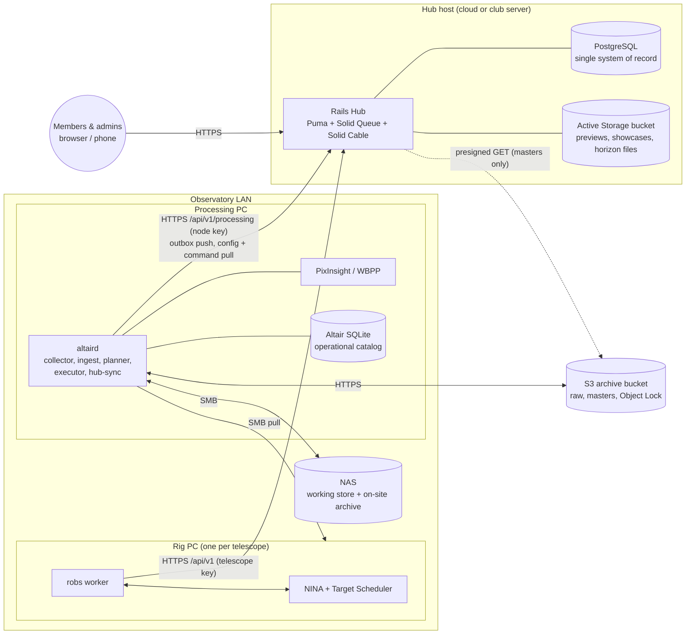
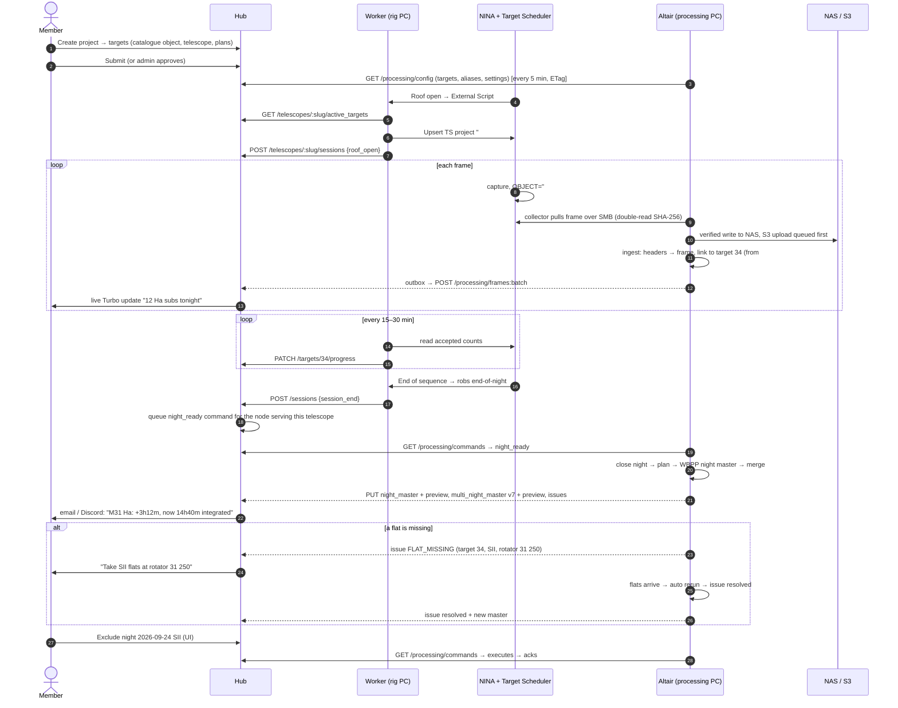
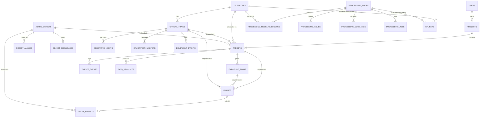

# Observatory Platform — System Architecture & Integration Guide

**Status:** Draft v1.2 (v1.1: personal telescopes removed from scope · v1.2: the repositories merge into one monorepo)
**Date:** 2026-09-25
**Scope:** How the four existing repositories become **one repository** holding one system
that runs on a single central database. It has three components that each stand alone and
talk to each other only through APIs. The document covers what has to change in each
component to get there.

| Today (separate repository) | Role today | Component in the monorepo | Role in the unified system |
|---|---|---|---|
| `remote-observatory-queueing-system` (this repo; becomes the monorepo) | Rails app: telescopes, targets, exposure plans, worker API | **`hub/`**: central server | **The Hub.** Central Postgres database, all human-facing UI, all APIs. Takes in the whole astrophotography-database feature set. |
| `remote-observatory-worker` | Python CLI on each rig PC: syncs NINA Target Scheduler, uploads subs, optional stacking | **`rig-agent/`** (package `robs`, called "the worker" below) | **Acquisition agent.** Hub → Target Scheduler sync and acquisition progress reporting only. Hands data off to Altair. |
| `altair-pre-processor` | Spec (v0.7) for a collector → NAS → S3 → WBPP pipeline with a local catalog | **`processing/`** (package `altair`, called "Altair" below) | **Processing core.** Collects, archives and processes frames *in the context of Hub projects and targets*. Reports frames, masters and issues to the Hub. |
| `astrophotography-database` | Electron desktop app: catalogue, projects, altitude charts, FITS indexer, file search | — (not moved in) | **Retired.** Every feature moves into the Hub (UI and data) or into Altair (file indexing). The existing data is imported once. The repository is archived. |

The repository layout, the rules for component independence, and how the histories are
merged are in §3.6.

Related documents: [`ARCHITECTURE.md`](../ARCHITECTURE.md) (current Hub ↔ worker contract,
superseded by §5 of this document once implemented) and the processing pipeline spec,
today `altair-pre-processor/docs/SPEC.md` and `processing/docs/SPEC.md` after the merge
(§8.2 below lists the changes it needs).

---

## 0. Summary of decisions

1. **One system of record.** The Hub's PostgreSQL database is the only place where shared,
   user-visible state lives: users, telescopes, optical trains, filters, the object
   catalogue, projects, targets, exposure plans, frames (as metadata), nights, data
   products, processing issues and commands. Every other component reads and writes it
   **only through the Hub's HTTP API**. Nothing connects to Postgres directly.
2. **Local operational stores stay local, as caches and journals.** Altair keeps its
   SQLite catalog, because processing must keep working when the internet or the Hub is
   down, and because its replica, fetch and job bookkeeping changes too often to push
   over a WAN. The worker keeps its small id-mapping DB. Neither is a system of record
   for anything a person sees. Altair reports everything user-visible to the Hub through
   a transactional **outbox**, and takes intent (projects, targets, settings, commands)
   **from** the Hub.
3. **Project hierarchy.** `Project` (new, owned by a user, the astrophotography-database
   concept) → `Target` (existing: one pointing, on one telescope, on one optical train)
   → `ExposurePlan` (existing: filter × exposure × count). An **Altair processing project
   is exactly one Hub target on one rig** (`hub_target_id`, `rig`). That keeps Altair's
   "one reference geometry per (target, telescope, camera)" rule without change.
4. **Frames are identified by SHA-256 everywhere.** Altair computes the hash at collection
   time. The Hub stores it as the frame's natural key, so reporting is idempotent and
   the Hub and Altair can always be reconciled.
5. **The NINA `OBJECT` header carries the Hub target id.** The worker already names
   Target Scheduler targets `#<target_id> <name>`, and NINA writes that into `OBJECT`.
   Altair links frames to Hub targets from that token first, then by name/alias plus
   coordinates. Frames it can't resolve are held and wait for a person to assign them
   in the Hub. They are never processed into a guessed project.
6. **One data pipeline.** Altair is the only component that moves, uploads, or stacks
   image data. The worker's S3 upload and Siril/PixInsight stacking are switched off
   (`data_pipeline: altair`) and later removed.
7. **One UI stack.** The Hub's existing Hotwire (Turbo + Stimulus) + Tailwind + Chart.js
   stack. The astrophotography-database React pages are ported to server-rendered views.
   Visibility maths runs **server-side in Ruby** (one implementation, cached). Charts are
   drawn from JSON by the existing `chart` Stimulus controller.
8. **Hub → Altair control goes through a command queue** that Altair polls: rerun,
   include/exclude night, waive issue, re-reference, approve fetch, assign frames,
   equipment event. The web UI can drive processing without anyone opening a port on
   the observatory network.
9. **One repository, three standalone components.** `hub/`, `rig-agent/` and `processing/`
   live in one monorepo with a shared `contracts/` directory (API schemas). Each component
   has its own dependencies, tests, CI job, release tag and deployment, and runs without the
   others. They never import each other's code. **All communication between components goes
   through the Hub's HTTP API**, including the "session ended" signal from the rig agent to
   Altair, which used to be a marker file (§3.6.3). The only thing that moves directly
   between machines is image data: Altair pulls frames from the rig PCs over SMB.

---

## 1. Goals & non-goals

### 1.1 Goals

- A member defines a **project** once in the Hub (objects from the catalogue, telescope,
  exposure plans) and sees its whole life in one place: scheduling, acquisition, archive,
  processing, results.
- **Progress** shows three honest numbers per exposure plan: *acquired* (Target Scheduler
  accepted), *collected* (frames safely archived), *integrated* (frames in the latest
  master).
- The **catalogue, altitude/visibility charts, best-season charts, "well placed tonight"
  and file search** from astrophotography-database work in the Hub for any telescope,
  using that telescope's real horizon.
- Altair runs **in the context of a Hub project/target id**: its projects, CLI, issues,
  and outputs are all addressable by Hub ids.
- Every component keeps working when another one is down, and catches up afterwards
  without losing anything or double-counting.

### 1.2 Non-goals (v1)

- Moving bulk image data into the Hub. The Hub stores metadata, previews and archive
  pointers. Raw frames and masters stay on the NAS and in S3, owned by Altair.
- Direct database connections from observatory machines to Postgres.
- Offline mobile sync (the astrophotography-database sql.js PWA). The Hub is responsive
  and already ships a PWA manifest. A read-only offline cache is future work (§13).
- Combining data from different optical trains into one master (still an Altair non-goal).
- **Members' personal telescopes.** The Hub only models the observatory's own telescopes. Every
  telescope is admin-managed, scheduled through a worker and processed by Altair. Frames from
  members' own equipment are not catalogued, and astrophotography-database's saved
  locations are not carried over (§8.4).
- Mosaic assembly (panels are modelled as separate targets; assembling them is future work).

---

## 2. The systems today, and where they overlap

| Concern | queueing-system | worker | Altair (spec) | astrophotography-database | **Decision** |
|---|---|---|---|---|---|
| Unit of user intent | `Target` (one telescope, coords, exposure plans) | — | `projects` = (target text, telescope, camera) | `Project` with many objects, goals in seconds per filter | Hub `Project` ⊃ `Target` ⊃ `ExposurePlan`. Altair project = (Hub target, rig). |
| Object names & catalogue | free-text `Target#name` | — | `aliases.target` regex YAML | OpenNGC/LDN/LBN catalogue + Telescopius resolver + aliases | Hub catalogue (`astro_objects`, `object_aliases`). Altair's target aliases come from the Hub. |
| Filters | free-text in wizard | `_KNOWN_FILTERS` guess from file name | `aliases.filter` YAML | FITS `FILTER` as-is | Per-optical-train filter list with aliases, in the Hub. Used by the wizard, worker and Altair. |
| Site / location | telescope lat/lon/elevation + horizon file | — | `site:` block | saved locations + timezone setting | Hub `telescopes` (lat, lon, elevation, **timezone**, horizon). Altair's `site:` is cross-checked against it. |
| Equipment | — | NINA profile GUID | `rigs:` (telescope + camera + optics + rotator) | FITS `TELESCOP`/`INSTRUME` strings | Hub `optical_trains` (one per Altair rig). Connection details and credentials stay in Altair's local config. |
| Image catalogue | — | — | `frames` (SQLite) | `images` (SQLite, from its own indexer) | Hub `frames`, a projection of Altair's frames. Altair's `altair index` replaces the desktop indexer. |
| Raw upload to S3 | stores URLs (`target_files`) | `end-of-night` uploads subs to its own bucket | collector → NAS → S3 archive (verified, Object Lock) | — | **Altair only.** Worker upload is switched off. |
| Stacking | — | optional Siril / PixInsight script | WBPP night masters + weighted multi-night masters | — | **Altair only.** Worker stacking is removed. |
| Progress | `completed_count` from worker | reports Target Scheduler accepted counts | knows collected, used and integrated frames | Σ exposure of linked images vs goals | All three are stored; see §4.3. |
| Notifications | email + Discord per user | — | toast, Pushover, email, status page | — | Hub notifies people. Altair keeps the Windows toast for the local operator. |
| Status UI | target pages, admin | — | static `ALTAIR_STATUS.html` | desktop app | Hub pages. Altair's static page stays as a local fallback. |

---

## 3. Target architecture

### 3.1 Deployment topology



All traffic from the observatory goes **outbound**: the worker and Altair call the Hub,
and the Hub never calls into the LAN. So the observatory needs no inbound firewall rules,
and the Hub can be hosted anywhere. When the Hub is hosted on the observatory LAN, the
design stays the same.

### 3.2 Component responsibilities

| Component | Owns | Reads from the Hub | Writes to the Hub |
|---|---|---|---|
| **Hub** (Rails) | Users, auth, telescopes, optical trains, filters, catalogue, projects, targets, exposure plans, processing settings, frames metadata, nights, data products, issues, commands, notifications, all UI | — | — |
| **Worker** (`robs`) | NINA Target Scheduler rows for Hub targets. Local id map. | `active_targets` (targets, plans, project info, NINA names, priorities, min altitudes) | Acquisition progress (accepted counts), session events (roof open/close, session end), heartbeat |
| **Altair** (`altaird`) | Everything about files: blobs, replicas, collection, NAS/S3, calibration, jobs, masters, local issue state | Processing config (optical trains, filters, targets and aliases, per-project processing settings), commands | Frames, nights, calibration masters, data products + previews, issues, job summaries, storage summaries, heartbeat |
| **NINA** | Capture | — (the worker feeds it) | — (the worker and Altair report for it) |

### 3.3 Data ownership

"System of record" means: when two copies disagree, this one wins.

| Data | System of record | Copies |
|---|---|---|
| Users, roles, notification preferences | Hub | — |
| Telescopes (site, timezone, horizon), optical trains, filter lists | Hub | Altair config cache (read-only), worker (slug only) |
| Object catalogue, aliases, showcases | Hub | Altair target-alias cache |
| Projects, targets, exposure plans, processing settings | Hub | Target Scheduler (via worker), Altair config cache |
| Acquisition accepted counts | Target Scheduler (via worker) | Hub `exposure_plans.completed_count` |
| Frame identity, headers, night, target link, quality, status | **Altair** (it reads the files) | Hub `frames` (projection) |
| Manual frame → target assignment | **Hub** (a person decided) | Altair (via `assign_frames` command, recorded as `assignment_source = manual`) |
| Replicas, storage locations, fetches, cleanup ledger | Altair | Hub gets a per-frame storage **summary** only |
| Calibration masters, night masters, multi-night masters, jobs | Altair | Hub `calibration_masters`, `data_products`, `processing_jobs` (projections) |
| Processing issues (state) | Altair (it detects and auto-resolves them) | Hub `processing_issues` (projection + notifications) |
| Waive / include / exclude / rerun decisions | Hub (a person decided) | Altair (via commands) |
| Equipment events (sensor cleaned, filter changed, …) | Hub | Altair (via commands) |
| Preview images (JPEG) | Hub Active Storage | — |
| Bulk image data (raw, calibrated, masters) | NAS + S3 (Altair) | — |

### 3.4 Key concepts and identifiers

| Concept | Definition | Identifier |
|---|---|---|
| **Telescope** | An observatory telescope at a site, with lat/lon/elevation/timezone/horizon, run by a worker. Every telescope in the Hub is an observatory telescope; members' own equipment is out of scope (§1.2). | `telescopes.slug` |
| **Optical train** | Telescope + camera + reducer as used for imaging: focal length, pixel size, sensor size, rotator, filter set. **One optical train = one Altair rig.** | `optical_trains.key` = Altair rig name (e.g. `esprit100_2600mm`) |
| **Project** | A member's imaging goal: one or more targets, priority, status, processing settings. | `projects.id` |
| **Target** | One pointing (catalogue object or custom coordinates, optional rotation) on one telescope/optical train, with exposure plans. The unit that is scheduled and processed. | `targets.id`. NINA name `#<id> <name>` |
| **Exposure plan** | Filter × exposure × desired count for a target. | `exposure_plans.id` |
| **Processing project** (Altair) | One target on one rig. It holds the reference frame and the multi-night masters per filter. | Altair `projects.id`, unique on (`hub_target_id`, `rig`) |
| **Night** | The local noon-to-noon window in the **telescope's** timezone, named by the date it starts (NINA `$$DATEMINUS12$$`). | `YYYY-MM-DD` + optical train |
| **Frame** | One captured file (light or calibration). | SHA-256 |
| **Data product** | A result: night master, multi-night master version, project reference, provisional preview, legacy upload. | Hub `data_products.id`. Altair (node, kind, altair_id) |
| **Processing node** | One Altair installation (processing PC). It serves one or more telescopes. | `processing_nodes.name` |

### 3.5 End-to-end lifecycle



### 3.6 Repository layout and component boundaries

#### 3.6.1 Layout

`remote-observatory-queueing-system` becomes the monorepo. It is renamed
**`remote-observatory`** on GitHub, which redirects the old URL. The Rails app moves from the
repository root into `hub/`.

```
remote-observatory/
├── hub/                    # Central server: Rails 8 app (was the repository root)
│   ├── app/ config/ db/ spec/ …
│   ├── Gemfile  package.json  Dockerfile  config/deploy.yml (Kamal)
│   └── README.md
├── rig-agent/              # Rig worker: Python package `robs` (was remote-observatory-worker)
│   ├── src/robs/  tests/  config/example.telescope.yml
│   ├── pyproject.toml
│   └── README.md
├── processing/             # Processing core: Python package `altair` (was altair-pre-processor)
│   ├── src/altair/  pjsr/  deploy/windows/  tests/
│   ├── docs/SPEC.md  docs/pixinsight-cli.md
│   ├── pyproject.toml
│   └── README.md
├── contracts/              # The API contract, the only thing all three components share
│   ├── schemas/            # JSON Schema for every request/response in §5
│   ├── examples/           # Example payloads (the ones in §5), validated in CI
│   ├── python/             # Package `observatory-contracts`: pydantic models generated from schemas/
│   └── CHANGELOG.md        # api_revision history
├── docs/
│   ├── SYSTEM_ARCHITECTURE.md   # this document
│   └── runbooks/           # cutover (§10), disaster recovery, per-site setup
├── tools/                  # Repo-wide scripts: schema codegen, release helpers
├── .github/workflows/      # hub.yml, rig-agent.yml, processing.yml, contracts.yml, release-*.yml
├── CLAUDE.md               # Repo-wide guidance + per-component commands
└── README.md               # What the system is, and which component to read about
```

Paths given elsewhere in this document are **relative to their component**: `app/models/…`
in §8.1 means `hub/app/models/…`, `src/altair/…` in §8.2 means `processing/src/altair/…`, and
the worker files in §8.3 are under `rig-agent/src/robs/`.

#### 3.6.2 Independence rules

Each component must be buildable, testable, releasable and runnable on its own.

| Rule | How it is enforced |
|---|---|
| No component imports another component's code. | Python: an import-linter contract in `rig-agent` and `processing` forbids `altair` ↔ `robs` imports. Ruby: `hub/` never loads files outside itself at runtime. CI builds each component from its own directory. |
| The only shared code is `contracts/`. | `rig-agent` and `processing` depend on `observatory-contracts` as a path dependency (`contracts/python`). The Hub reads `contracts/schemas/` in its request specs only, never at runtime, so the Hub's Docker build context stays `hub/`. |
| Each component has its own dependency manifest and lockfile. | `hub/Gemfile.lock` + `hub/package.json`, `rig-agent/pyproject.toml` + lock, `processing/pyproject.toml` + lock. No root-level lockfile. |
| Each component has its own CI. | Path-filtered workflows: `hub.yml` (rubocop, brakeman, bundler-audit, rspec) runs on `hub/**` or `contracts/**` changes. `rig-agent.yml` (pytest) on `rig-agent/**` or `contracts/**`. `processing.yml` (pytest on Linux, plus Windows-only tests on a Windows runner) on `processing/**` or `contracts/**`. `contracts.yml` validates schemas and examples. A change to `contracts/` therefore runs every component's suite. |
| Each component is released and deployed on its own. | Tags `hub-vX.Y.Z`, `rig-agent-vX.Y.Z`, `processing-vX.Y.Z`. The Hub deploys with Kamal from `hub/`. The rig agent ships as a wheel / PyInstaller `robs.exe`. The processing core ships as `altair.exe`. The monorepo does **not** mean lockstep deploys: the Hub runs in the cloud, while rig PCs and the processing PC are upgraded on their own schedule. |
| Versions interoperate across releases. | `contracts/CHANGELOG.md` records each `api_revision`. The Hub serves the current and previous revision. Each client declares the revision range it supports, and `robs check-config` / `altair doctor` fail clearly on a mismatch (§5.5). |

#### 3.6.3 Standalone operation

Each component still works when the others are missing, not only when they are temporarily
down (§6.4 covers outages).

| Component | Runs alone? | Without the others it… | Configuration |
|---|---|---|---|
| **Hub** | Yes | Serves the catalogue, projects, targets, visibility charts, wizard, admin. Frames, progress and masters stay empty until agents report. | Default. |
| **Rig agent** | Yes | Reads targets from a local file instead of the Hub, syncs them into Target Scheduler, and writes progress and session events to local JSON logs. | `hub.enabled: false` + `targets_file:` (JSON in the `active_targets` schema from `contracts/`). |
| **Processing core** | Yes | Behaves as Altair SPEC v0.7: YAML aliases, text-target projects, the local status page, and nights closed by the session-end marker file or quiescence. | `hub.enabled: false` (and `require_target_link: false`). |

**Session end goes through the API.** With the Hub in use, the rig agent posts
`session_end` to the Hub (§5.2), and the Hub queues a `night_ready` command for every
processing node that serves that telescope (§5.4). Altair treats it exactly like the
session-end marker. The marker file (`_altair/session-end-*.json`, SPEC §4.2) remains the
signal only in standalone operation, when no Hub is configured. Either way, quiescence and
the scheduled fallback (SPEC §6.1) still close a night if no signal arrives.

#### 3.6.4 Merging the repositories

Done once, in P0 (§9), with history preserved:

1. In this repository, `git mv` everything except `.github/`, `docs/` and the root README
   into `hub/`. Fix the paths in `Dockerfile`, `config/deploy.yml`, `Procfile.dev`,
   `bin/*` and the CI workflow. `git log --follow` keeps per-file history.
2. `git subtree add --prefix=rig-agent <remote-observatory-worker> main` and
   `git subtree add --prefix=processing <altair-pre-processor> main`. The full histories
   come in as merge commits. Neither is squashed.
3. Move the worker's and Altair's `ARCHITECTURE.md` copies out: the worker's becomes a
   short `rig-agent/README.md` section pointing here, and Altair's spec stays at
   `processing/docs/SPEC.md`.
4. Create `contracts/` with the schemas from P0, and the per-component workflows.
5. Rename the repository to `remote-observatory`. Put a README banner ("moved to
   `remote-observatory/rig-agent`", "moved to `remote-observatory/processing`") on
   `remote-observatory-worker` and `altair-pre-processor`, then archive them.
6. `astrophotography-database` is **not** merged in. It gets its final release and is
   archived (§8.4). The one thing kept from it, the visibility-fixtures script, runs from
   its final release, and only its JSON output is committed, under `hub/spec/fixtures/visibility/`.

---

## 4. Unified domain model (Hub, PostgreSQL)

### 4.1 Entity relationships



### 4.2 Tables

**Changed tables** (all changes are additive migrations, except the one rename):

| Table | Change |
|---|---|
| `telescopes` | + `timezone` (IANA, required, backfilled from a site default) · + `min_altitude_deg` (default 30) · + `default_optical_train_id`. Telescopes stay admin-managed, and a telescope is schedulable when it is `active` (unchanged). |
| `targets` | + `project_id` (required after backfill) · + `astro_object_id` (nullable: custom coordinates allowed) · + `optical_train_id` (nullable → the telescope's default) · + `rotation_deg` (sky position angle, nullable) · + `panel` (mosaic label, nullable) · + `is_primary` (the project's primary target for visibility) · + `min_altitude_deg` override · + `processing_settings` jsonb (overrides the project's) · + `schedule_count_basis`, see §4.3. `user_id` stays, validated to equal `project.user_id` (kept for existing policies and the API). Method `nina_name` → `"##{id} #{name}"`. |
| `exposure_plans` | `completed_count` keeps its meaning: **acquired** (Target Scheduler accepted), set by the worker. + `collected_count`, `usable_count`, `integrated_count` (integers, default 0) · + `integrated_seconds` (decimal) · `filter` must be a canonical filter of the target's optical train. |
| `target_files` → **`data_products`** | Renamed. `url` becomes nullable (legacy worker uploads only). + `project_id`, `optical_train_id`, `processing_node_id`, `altair_id` · `kind` enum extended: `sub` (legacy), `stacked` (legacy), `preview` (legacy), `log`, `night_master`, `multi_night_master`, `project_reference`, `provisional_noflat` · + `night`, `filter`, `version`, `sha256`, `size_bytes`, `archive_uri` (`s3://…`), `nas_path` · + `metrics` jsonb (frames, rejected, total exposure, FWHM, eccentricity, SNR, per-night weights) · + `superseded_by_id` · `has_one_attached :preview`, `:thumbnail`. `Target#preview_image_url` is replaced by the latest final product's thumbnail (the column is kept for legacy rows). |
| `api_keys` | `telescope_id` → polymorphic `owner` (`Telescope` or `ProcessingNode`). + `scopes` string array. Existing rows migrate to `owner_type = "Telescope"`, scopes `["targets:read","progress:write","events:write","sessions:write"]`. |
| `target_events` | `event_type` enum extended: `frames_collected`, `night_closed`, `master_updated`, `issue_opened`, `issue_resolved`, `session`. Notifications keep hanging off `after_create_commit`. |

**New tables:**

```text
optical_trains
  id, telescope_id FK, key (unique per telescope; = Altair rig name), name,
  camera_name, camera_type enum(mono, osc), bayer_pattern,
  pixel_size_um, sensor_width_px, sensor_height_px, focal_length_mm,
  has_rotator bool, filters jsonb   -- [{name:"Ha", aliases:["H-alpha","HA"], bandpass_nm:7}]
  header_aliases jsonb              -- {telescope:["Esprit 100ED"], camera:["ZWO ASI2600MM Pro"]}
  active bool, timestamps
  computed: pixel_scale_arcsec = 206.265 * pixel_size_um / focal_length_mm; fov_deg

astro_objects                                  -- port of astrophotography-database `objects`
  id, primary_name, ra_deg, dec_deg, object_type, magnitude,
  size_major_arcmin, size_minor_arcmin, position_angle_deg, constellation,
  source enum(openngc, ldn, lbn, telescopius, custom), source_ref, created_by_id,
  timestamps
  index: gin(primary_name gin_trgm_ops), btree(dec_deg), btree(object_type), btree(constellation)

object_aliases
  id, astro_object_id FK, name, normalized_name, catalog   -- "M", "NGC", "IC", "Sh2", "LDN", …
  index: gin(normalized_name gin_trgm_ops), btree(normalized_name)

object_showcases
  id, astro_object_id FK unique, source_type enum(upload, product, survey),
  data_product_id FK nullable, survey_name, image (Active Storage), timestamps

projects
  id, user_id FK, name, description, status enum(planning, active, paused, completed, archived),
  priority int, visibility enum(private, club),
  completion_basis enum(acquired, integrated) default acquired,
  processing_settings jsonb, timestamps

frames                                         -- projection of Altair `frames` (+ astrophotography-database `images`)
  id, sha256 (unique), processing_node_id FK, altair_frame_id,
  telescope_id FK, optical_train_id FK, target_id FK nullable, project_id FK nullable (denormalised),
  exposure_plan_id FK nullable, assignment_source enum(header_token, name, coords, manual, unlinked),
  image_type enum(light, dark, flat, bias, darkflat), night date, date_obs timestamptz,
  object_header, filter, exposure_s, gain, offset, binning, readout_mode, sensor_temp_c,
  rotator_pos, rotator_units, ra_deg, dec_deg, rotation_deg, width_px, height_px,
  fov_width_deg, fov_height_deg, file_name, logical_path,
  status enum(collected, valid, invalid, held, processed, rejected),
  status_reason, quality jsonb (fwhm, eccentricity, stars, psf_signal_weight, weight),
  storage jsonb ({nas: bool, s3: "STANDARD_IA"|"DEEP_ARCHIVE"|null, verified_at}),
  headers jsonb, origin enum(collect, import, legacy_index), timestamps
  indexes: (target_id, filter), (telescope_id, night), (date_obs), (image_type), (filter),
           (dec_deg), gin(file_name gin_trgm_ops), (project_id)

frame_objects                                  -- port of astrophotography-database `image_objects`
  id, frame_id FK, astro_object_id FK, association enum(primary, in_fov), angular_distance_arcmin
  unique(frame_id, astro_object_id)

observing_nights
  id, telescope_id FK, optical_train_id FK, night date,
  state enum(open, closing, closed), closed_by, roof_open_at, roof_closed_at,
  session_end_at, lights_count, calibration_count, light_seconds, manifest_sha256,
  unique(optical_train_id, night)

calibration_masters                            -- projection, for the calibration-library view and issue context
  id, processing_node_id, altair_id, optical_train_id, kind, filter, exposure_s, gain, offset,
  binning, sensor_temp_c, rotator_pos, night, n_frames, sha256, superseded bool
  unique(processing_node_id, altair_id)

equipment_events
  id, optical_train_id FK, at, kind enum(sensor_cleaned, filter_changed, camera_rotated_manually,
  reducer_changed, collimated, other), filter, note, created_by_id, altair_synced_at

processing_nodes
  id, name unique, description, active, last_heartbeat_at, status jsonb
  (versions, queue depth, running job, locations reachable, NAS free %, S3 backlog, outbox depth)

processing_node_telescopes
  processing_node_id FK, telescope_id FK, unique pair

processing_issues
  id, processing_node_id FK, fingerprint, altair_id, kind, severity enum(blocking, warning, info),
  status enum(open, resolved, waived), message, requirement jsonb, scope jsonb,
  telescope_id, optical_train_id, project_id, target_id, night, filter,   -- all nullable
  opened_at, resolved_at, resolution, last_notified_at
  unique(processing_node_id, fingerprint)

processing_jobs                                -- summary only; Altair keeps the full job table
  id, processing_node_id, altair_id, kind, status, target_id, night, filter,
  started_at, finished_at, error, unique(processing_node_id, altair_id)

processing_commands
  id, processing_node_id FK, kind, payload jsonb, requested_by_id FK users,
  state enum(pending, delivered, succeeded, failed, cancelled), result jsonb,
  delivered_at, completed_at, timestamps
```

`best_viewing_cache` from astrophotography-database is **not** ported as a table. Visibility
results go in `Rails.cache` (Solid Cache, already configured), keyed by
`(object or target, telescope, year or night, min_altitude, horizon digest)`.

### 4.3 Progress model

Each `ExposurePlan` carries four counters. Each has exactly one writer:

| Counter | Meaning | Written by | When |
|---|---|---|---|
| `completed_count` (**acquired**) | Frames Target Scheduler accepted | Worker (`PATCH /targets/:id/progress`, set not increment) | Every 15–30 min through the night |
| `collected_count` | Lights on the NAS, verified, linked to this plan, not `invalid` | Hub, recomputed from `frames` on each frame batch | As Altair reports frames |
| `usable_count` | Lights used (not rejected) in a **final** (flat-verified) night master | Hub, from `data_products.metrics` + frame status | After each night master |
| `integrated_count` / `integrated_seconds` | Lights / seconds in the latest multi-night master for this filter | Hub, from the latest `multi_night_master` product | After each merge |

**Frame → plan matching** (Hub, on frame upsert): same target, canonical filter equal, and
`|exposure_s − plan.exposure_seconds| ≤ 0.5 s`. A light that matches no plan keeps
`exposure_plan_id = null`. It still counts in the project's per-filter totals as
"unplanned".

**Project progress** follows the astrophotography-database semantics: goal seconds per
filter = Σ `exposure_seconds × desired_count` across targets. For each basis the page
shows the actual seconds per filter, % per filter (capped at 100) and an overall % (the
mean across goal filters).

**Completion.** `projects.completion_basis`:

- `acquired` (default, today's behaviour): a target completes when every plan's
  `completed_count ≥ desired_count`, exactly as `Api::V1::TargetsController#progress` does
  now.
- `integrated`: a target completes only when every plan's `integrated_count ≥
  desired_count`. So Target Scheduler has to keep imaging to replace frames Altair
  rejected. `active_targets` returns a `schedule_count` per plan =
  `desired_count + max(0, completed_count − usable_count)`, counted only over nights that
  have been processed. The worker writes `schedule_count` (not `desired_count`) into
  Target Scheduler. With basis `acquired`, `schedule_count == desired_count`.

### 4.4 Naming and time contract (shared by all three agents)

- **NINA target name** = `"#<target_id> <target name>"`, generated by the Hub (`nina_name` in
  `active_targets`). NINA writes it to `OBJECT` and to `$$TARGETNAME$$` folders.
- **Target Scheduler project name** = `"#P<project_id> <project name>"`.
- **Header token regex** (Altair): `^#(\d+)(\s|$)`.
- **Night** = `(date_obs in telescope.timezone − 12 h).date`. The Hub's `telescopes.timezone`
  and Altair's `site.timezone` for that rig must match. `altair doctor` and `robs
  check-config` both check this.
- **Canonical filter names** come from `optical_trains.filters[].name`. Aliases map raw
  `FILTER` header values onto them (case-insensitive exact match, then aliases).
- **Altair logical paths** for linked processing projects:
  `projects/<rig>/T<target_id>_<slug(target name at creation)>/…`. The target id anchors
  the path. Renaming a target in the Hub never renames archived paths.

---

## 5. Hub API contract

Everything is under `/api/v1` and changes are additive. Existing worker endpoints keep
their shape and only gain fields. A breaking change would ship as `/api/v2` alongside v1.

### 5.1 Authentication, principals and scopes

- `Authorization: Bearer <token>` (or `X-Api-Key`), as today. Tokens are stored as SHA-256
  digests (`ApiKey.authenticate`, unchanged).
- An `ApiKey` belongs to a **Telescope** (worker) or a **ProcessingNode** (Altair).
- Scopes (checked per action with `require_scope!`):

| Scope | Worker | Altair | Grants |
|---|---|---|---|
| `targets:read` | ✓ | ✓ | `active_targets`, processing config |
| `progress:write` | ✓ | | `PATCH /targets/:id/progress` |
| `events:write` | ✓ | ✓ | `POST /targets/:id/events` |
| `sessions:write` | ✓ | | session events |
| `files:write` | ✓ (legacy only) | | `POST /targets/:id/files` |
| `frames:write` | | ✓ | frames, nights, calibration masters |
| `products:write` | | ✓ | data products + previews |
| `issues:write` | | ✓ | issues, jobs |
| `commands:read` | | ✓ | command poll + ack |
| `heartbeat:write` | ✓ | ✓ | heartbeat |

- **Resource scoping:** a telescope key may only touch its own telescope's targets (today's
  rule). A node key may only touch telescopes listed in `processing_node_telescopes`, and
  targets, frames, nights, issues and products under them.
- Rate limiting uses Rails 8's built-in `rate_limit` (e.g. 600 req/min per key). Preview
  uploads are capped at 10 MB.

### 5.2 Worker endpoints

**`GET /api/v1/telescopes/:slug/active_targets`**. Existing fields are unchanged. New ones
are marked `+`:

```json
{
  "telescope": { "id": 3, "slug": "backyard-16in", "name": "Backyard 16in",
                 "timezone": "America/Los_Angeles" },
  "targets": [{
    "id": 34, "name": "M31", "ra_deg": 10.68471, "dec_deg": 41.26875,
    "status": "active", "priority": 5, "notes": null,
    "nina_name": "#34 M31",
    "rotation_deg": 35.0,
    "min_altitude_deg": 30,
    "project": { "id": 12, "name": "Andromeda deep", "priority": 5,
                 "ts_project_name": "#P12 Andromeda deep" },
    "optical_train": { "key": "esprit100_2600mm" },
    "exposure_plans": [{
      "id": 88, "filter": "Ha", "exposure_seconds": 300,
      "desired_count": 120, "completed_count": 41, "remaining_count": 79,
      "schedule_count": 126
    }]
  }]
}
```

The effective `priority` sent to Target Scheduler is `project.priority` (the target's own
`priority` breaks ties).

**`PATCH /api/v1/targets/:id/progress`**: unchanged. It sets `completed_count`, and
auto-completion follows `completion_basis` (§4.3).

**`POST /api/v1/telescopes/:slug/sessions`** (new):
`{ "event": "roof_open"|"roof_close"|"session_end", "at": "…", "night": "2026-09-24", "target_ids": [34, 35] }`.
It upserts `observing_nights` (roof times) and emits a `session` target event on the listed
targets. The Hub dashboard uses this for "imaging now". A `session_end` also queues a
`night_ready` command (§5.4), one per optical train of the telescope, for each processing
node that serves it.

**`POST /api/v1/heartbeat`** (new, both principals):
`{ "agent": "robs"|"altair", "version": "…", "status": { … } }`.

**`POST /api/v1/targets/:id/files`**: kept for `data_pipeline: legacy` workers. It creates a
`data_products` row of kind `sub`/`stacked`/`preview` with `url`.

### 5.3 Processing endpoints (Altair)

All live under `/api/v1/processing`.

**`GET /config`** returns the node's world, with an `ETag`. Altair sends `If-None-Match`
and gets `304` when nothing changed:

```json
{
  "api_revision": 1,
  "node": { "name": "altair-proc-01" },
  "telescopes": [{
    "slug": "backyard-16in", "timezone": "America/Los_Angeles",
    "latitude": 37.3, "longitude": -121.9, "elevation_m": 120,
    "optical_trains": [{
      "key": "esprit100_2600mm", "camera_type": "mono", "focal_length_mm": 550,
      "pixel_size_um": 3.76, "sensor_width_px": 6248, "sensor_height_px": 4176,
      "has_rotator": true,
      "filters": [{ "name": "Ha", "aliases": ["H-alpha", "HA"] }],
      "header_aliases": { "telescope": ["Esprit 100ED"], "camera": ["ZWO ASI2600MM Pro"] }
    }]
  }],
  "targets": [{
    "id": 34, "project_id": 12, "telescope": "backyard-16in", "optical_train": "esprit100_2600mm",
    "name": "M31", "nina_name": "#34 M31", "status": "active",
    "ra_deg": 10.68471, "dec_deg": 41.26875, "rotation_deg": 35.0,
    "aliases": ["M31", "M 31", "NGC 224", "Andromeda Galaxy"],
    "processing_settings": {
      "multi_night": { "enabled": true, "mode": "master_merge" },
      "reference_filter": "Ha", "drizzle_scale": 1, "keep_calibrated_frames": true,
      "pin_to_nas": false, "min_lights_per_stack": 5, "max_fwhm_ratio_to_project_median": 1.6,
      "wbpp_profile": "default"
    }
  }],
  "equipment_events": [{ "id": 7, "optical_train": "esprit100_2600mm", "at": "…",
                         "kind": "sensor_cleaned", "filter": null, "note": "…" }]
}
```

`targets` covers every non-draft target on the node's telescopes, including completed and
cancelled ones: late frames and reruns still have to resolve. `processing_settings` is
already merged: Altair defaults ← project ← target.

**`POST /frames:batch`** takes up to 500 frames and **upserts by `sha256`**:

```json
{ "frames": [{
    "sha256": "9f2c…", "altair_frame_id": 81234, "origin": "collect",
    "telescope": "backyard-16in", "optical_train": "esprit100_2600mm",
    "target_id": 34, "assignment_source": "header_token",
    "image_type": "light", "night": "2026-09-24", "date_obs": "2026-09-25T06:10:02Z",
    "object_header": "#34 M31", "filter": "Ha", "exposure_s": 300, "gain": 100, "offset": 50,
    "binning": "1x1", "sensor_temp_c": -10.1, "rotator_pos": 31250, "rotator_units": "steps",
    "ra_deg": 10.69, "dec_deg": 41.27, "width_px": 6248, "height_px": 4176,
    "file_name": "2026-09-24_23-10-02_Ha_300.00s_0001.fits",
    "logical_path": "raw/esprit100_2600mm/2026-09-24/#34 M31/LIGHT/Ha/…_0001.fits",
    "status": "valid", "storage": { "nas": true, "s3": null },
    "headers": { "IMAGETYP": "LIGHT", "…": "…" }
}] }
```

Response: `{ "results": [{ "sha256": "9f2c…", "id": 551, "target_id": 34, "exposure_plan_id": 88, "status": "ok" }] }`.
Each item succeeds or fails on its own (`status: "error", "error": "…"`). A frame is never
rejected just because its target is unknown: it is stored with `target_id = null` and
shows up in the "Unassigned frames" inbox.

- **Assignment precedence:** once `assignment_source = manual` in the Hub, Altair upserts
  cannot change `target_id`. The response returns the manual `target_id`, and Altair adopts
  it (belt-and-braces with the `assign_frames` command).
- After commit, the Hub recomputes plan counters (debounced per target) and enqueues
  `FrameFovMatchJob` (§7.2). It emits one `frames_collected` event per (target, night,
  filter) per hour, rather than one per frame, and broadcasts a Turbo Stream to the
  project page.

**`PATCH /frames:batch`** makes partial updates by `sha256`: `status`, `status_reason`,
`quality`, `storage`. Used when frames are graded, rejected, uploaded, or moved to S3-only.

**`PUT /nights/:optical_train/:night`**: collection state, counts, `closed_by`,
`manifest_sha256`.

**`PUT /calibration_masters/:altair_id`**: projection upsert.

**`PUT /data_products/:kind/:altair_id`** is a multipart upload: a `metadata` JSON part plus
optional `preview` (JPEG, long edge ≤ 2048 px) and `thumbnail` (≤ 512 px) parts. Kinds:
`night_master`, `multi_night_master`, `project_reference`, `provisional_noflat`. Metadata:
target, night/version, filter, sha256, size, `archive_uri`, `nas_path`, `metrics`,
`supersedes_altair_id`. It emits `master_updated` (which notifies the owner) and updates
plan counters.

**`PUT /issues/:fingerprint`** upserts
`{ kind, severity, status, message, requirement, scope, target_id?, night?, filter?, resolution? }`.
An `open` → `resolved`/`waived` transition emits `issue_resolved`. A new open issue emits
`issue_opened` (routing in §7.4).

**`PUT /jobs/:altair_id`**: job summary upsert.

**`GET /commands?state=pending`** → `[{ id, kind, payload, created_at }]` (marks them
`delivered`). **`POST /commands/:id/ack`** `{ state: "succeeded"|"failed", result }`.

**`GET /nights/:optical_train/:night/digest`** →
`{ frame_count, sha256_xor, by_type: {…} }`, for reconciliation (§6.3).

### 5.4 Command kinds (Hub → Altair)

Each command runs the same code path as the matching Altair CLI command.

| Kind | Payload | Altair CLI equivalent | UI entry point |
|---|---|---|---|
| `assign_frames` | `{ sha256s: [...] \| selector, target_id }` | `altair frames assign` | Unassigned-frames inbox, frame search bulk action |
| `rerun` | `{ target_id?, night?, filter?, issue_id? }` | `altair rerun` | Project page, issue page |
| `night_include` / `night_exclude` | `{ target_id, night, filter }` | `altair night include\|exclude` | Project → nights table |
| `issue_waive` | `{ fingerprint, note }` | `altair issue waive` | Issue page |
| `rereference` | `{ target_id, from_night? }` | `altair project rereference` | Project → processing (with a confirmation) |
| `set_mode` | `{ target_id, mode }` | `altair project set-mode` | Project → processing settings |
| `approve_fetch` / `deny_fetch` | `{ fingerprint }` | `altair storage approve\|deny` | Issue page (admins) |
| `equipment_event` | `{ equipment_event_id }` (Altair reads the details from `/config`) | `altair equipment log` | Telescope → optical train page |
| `refresh_config` | `{}` | — (forces a config pull) | Admin → node page |
| `night_ready` | `{ optical_train, night, at, closed_by: "session_end" }` | — (same effect as the session-end marker, SPEC §6.1) | — (queued automatically by `POST /telescopes/:slug/sessions` with `event: session_end`) |

Commands are idempotent by `id`: Altair records the command ids it has executed and acks
again without re-executing if it sees one twice. Processing-settings changes don't need a
command, because they arrive with the next config pull. A change that forces a
re-reference (e.g. `drizzle_scale`) is shown in the UI as needing a confirmed
`rereference` command.

### 5.5 Errors and idempotency

- `401` for a bad key, `403` for the wrong scope or resource, `404` for an unknown resource,
  `422` for validation errors (`{ "error": "…", "details": {…} }`), `409` for a manual
  assignment conflict (with the winning value).
- Every write is an upsert on a natural key (`sha256`, `fingerprint`, `(node, altair_id)`,
  `(optical_train, night)`), or a "set, don't increment" update. Every client can resend
  any request safely.
- `api_revision` in `/config` lets clients log a warning when the Hub is newer than they
  know.

---

## 6. Synchronisation, offline behaviour and failure modes

### 6.1 Altair outbox

- A table `hub_outbox(id, kind, natural_key, payload_json, created_at, attempts,
  next_attempt_at, sent_at, last_error)` in Altair's SQLite. It is written **in the same
  transaction** as the catalog change it describes, so nothing is ever lost between "Altair
  knows" and "the Hub knows".
- A `hub_sync` worker thread in `altaird` drains it in id order, batching frames (≤ 500) and
  coalescing repeated updates to the same natural key (only the newest payload is sent).
- Back-off: exponential, from 5 s up to `hub.outbox.max_backoff_s` (default 15 min).
  Network errors and `5xx` retry forever. A `4xx` retries 5 times, then the item is parked
  and `HUB_REJECTED` (warning) is raised with the error text.
- Previews are rendered into the local cache and uploaded from there. If the Hub is down for
  days, they are sent when it comes back.
- The Hub being unreachable **never** blocks collection, backup or processing. After
  `hub.unreachable_alert_minutes` (default 60), `HUB_UNREACHABLE` (warning) is raised
  locally (toast + status page).

### 6.2 Config and command pull

- `GET /processing/config` every `hub.config_poll_s` (default 300 s) with `ETag`. The last
  good copy is cached in `hub_cache` in SQLite and used while the Hub is unreachable.
- `GET /processing/commands` every `hub.command_poll_s` (default 60 s).
- If there is no cached config at all (first start, Hub down), Altair still collects and
  backs up, but holds unresolved lights until a config arrives.

### 6.3 Reconciliation

- Nightly (after cleanup), `altair hub reconcile` compares, per closed night, its local
  digest (frame count, XOR of SHA-256s, counts by type) with
  `GET /nights/:train/:night/digest`. On a mismatch it re-queues every frame of that night
  (upserts are idempotent).
- The Hub runs a daily `ProgressRecomputeJob` over all active targets, so counters can
  never drift from `frames` and `data_products`.
- The worker's progress sync is already idempotent (counts are set, not incremented).

### 6.4 Failure modes

| Failure | Effect | Recovery |
|---|---|---|
| Hub down during the night | Worker `roof-open` can't fetch targets. Target Scheduler keeps last night's rows and images them. Altair collects, backs up and processes as usual. | Worker retries on the next `roof-open`/`sync-progress`. Altair's outbox drains when the Hub is back. |
| Internet down at the observatory | Same as above. | Same as above. |
| Worker not run / crashed | No accepted counts. `collected_count` still rises from Altair. | The next `sync-progress` sets the counts. |
| Target deleted or cancelled in the Hub after frames were captured | Frames still resolve (`/config` includes cancelled targets). They are archived and processed. | — |
| Frame's `OBJECT` has no `#id` (manual NINA sequence, legacy archive) | Name/alias + coordinates resolution (§8.2.3). If that fails, `PROJECT_UNRESOLVED` and the lights are `held`. | Assign in the Hub → `assign_frames` → Altair links and plans. |
| Hub and Altair disagree on a frame's target | A manual Hub assignment wins. Otherwise Altair's (it read the file). | §5.3 assignment precedence. |
| Timezone mismatch between Hub telescope and Altair site | Night boundaries differ. | `altair doctor` / `HUB_CONFIG_MISMATCH` block until fixed. |
| Filter in headers not in the Hub's filter list | Frame stored with the raw filter, flagged. | Add the alias in the Hub. The next config pull re-normalises it and the frames are re-reported. |
| A processing node key leaks | It can write frame/issue data for its telescopes only. It can't read users or other telescopes. | Revoke in Admin → node → API keys. |

---

## 7. The Hub: UI and features (astrophotography-database subsumed)

### 7.1 Frontend stack

The existing stack stays: **Turbo + Stimulus + Tailwind 4 + Chart.js**, bundled by esbuild.

- The React pages are **ported to ERB views + Stimulus controllers**, not embedded. That
  keeps one stack, one auth/session model, Pundit on every page, and Turbo Streams for
  live updates (Solid Cable is already configured).
- New JS dependencies: `chartjs-plugin-annotation` (twilight bands, "now" line, min-altitude
  line), `chartjs-adapter-date-fns` (time axes). Existing `chart_controller.js` gets options
  for time axes and annotations.
- Big lists (catalogue, frame search) use server-side pagination (`pagy`) inside Turbo Frames,
  replacing `@tanstack/react-virtual`. Filters are GET params, so every view is linkable.
- Fallback: if a component turns out to need rich client-side interaction (e.g. a future
  sky-map/FOV planner), mount it as an isolated island from a Stimulus controller. Don't
  add React by default.

### 7.2 Visibility and FOV engine (server-side Ruby)

A port of `visibility_service.py` (astroplan) and `fov_matcher.py` into
`app/lib/astro/`:

| Module | Content |
|---|---|
| `Astro::Coordinates` | LST, RA/Dec → Alt/Az, angular separation, parallactic angle |
| `Astro::Ephemeris` | Sun and Moon positions, twilight times (civil/nautical/astronomical), moon illumination. Uses the **`astronoby`** gem. If Phase 2's golden tests show it isn't accurate enough, fall back to a Meeus low-precision implementation (arc-minute level is plenty here). |
| `Astro::Horizon` | Wraps `Telescope#horizon_points`. Linear interpolation by azimuth, wrap-around at 360°. `effective_min_alt(az) = max(horizon(az), min_altitude)`. |
| `Astro::Visibility` | Altitude series for a night (5-min steps), hours above the effective horizon during astronomical darkness, transit time/altitude, moon separation, `imaging_score` (the astrophotography-database formula), declination bounds, batch visibility, best-viewing by month + peak season |
| `Astro::FovMatcher` | Catalogue objects inside a frame's footprint (centre, FOV, rotation). Declination prefilter, then separation. |

- **Upgrade over astrophotography-database:** everything uses the **telescope's horizon
  mask**, not just a flat minimum altitude, because the Hub knows which telescope a target is on.
- Results are cached in Solid Cache (tonight's series: until local noon; best-viewing: per
  year; well-placed lists: 1 h per telescope).
- `FrameFovMatchJob` groups frames by (target, optical train, rounded pointing, rotation)
  and computes the footprint once per group, not once per frame.
- **Golden tests:** a one-off script in the astrophotography-database repo dumps
  astroplan results for about 20 objects × 3 dates × 2 sites to JSON fixtures. Hub specs
  assert altitude within ±0.5°, twilight within ±2 min, and best month identical.

### 7.3 Pages

| astrophotography-database | Hub page | Notes |
|---|---|---|
| `Dashboard` (well-placed objects/projects, best viewing mini) | `/` **Dashboard** | My projects' progress, "Tonight" per telescope (my targets ranked by `imaging_score`, well-placed catalogue suggestions), "imaging now" from session events, open issues that need me. Admins also get node health (heartbeat, NAS free, S3 backlog, outbox depth). |
| `ObjectsPage`, `CataloguePage`, `SearchBar` | `/objects` **Catalogue** | Trigram search over names + aliases. Facets: type, constellation, catalogue, magnitude, size. "Well placed tonight at ⟨telescope⟩" filter. Mini altitude sparkline per row. |
| `ObjectDetailPage`, `AltitudeChart`, `MiniAltitudeChart`, `BestViewingChart`, `BestViewingMini`, `ShowcaseImage`, `ShowcaseManager` | `/objects/:id` | Tonight's altitude chart with a telescope picker (twilight bands, horizon mask, moon), best-viewing chart, aliases, showcase (upload / from a data product / SkyView survey job), filter stats from my frames, frames of the object, projects containing it, **"Start a project"** button. |
| `CreateObjectModal` | `/objects/new` | Resolve via Telescopius (Ruby client on Faraday, local-first like `NameResolver`) or custom coordinates. |
| `ProjectsPage`, `ProjectCard` | `/projects` | Cards: cover thumbnail, per-filter progress bars, status, priority, next good night. |
| `ProjectDetailPage`, `ExposureProgress`, `ProgressBar`, `SessionCard`, `ProjectForm` | `/projects/:id` with tabs | **Overview:** per-filter bars (goal vs acquired / collected / integrated), cumulative integration hours per filter over nights (line), latest multi-night master per filter (gallery). **Targets:** targets and plans, status, cancel/submit. **Nights:** one row per night per target (SessionCard): frames, hours, FWHM, night weight, merge status, include/exclude. **Quality:** FWHM and eccentricity per night (scatter). **Issues.** **Visibility:** altitude tonight + best season for each target. **Processing:** settings, rerun, re-reference, command history. |
| Target wizard (existing Hub) + `ProjectForm` | `/projects/new` → wizard | Steps: **Objects** (catalogue search, or custom coordinates; several targets or mosaic panels allowed) → **Telescope** (each candidate telescope shows tonight's altitude + best season *with its horizon*, and whether the object fits its FOV) → **Exposures** (filter dropdown from the optical train, not free text) → **Review**. The existing session-backed wizard controller is extended, not replaced. |
| `ImagesPage`, `ImageTable` (grouped view, stats) | `/frames` **File search** | Filters: object name/alias (via targets and `frame_objects`), cone search (RA/Dec + radius), project, target, telescope, optical train, filter, image type, night/date range, exposure, gain, binning, status, storage tier, unassigned-only. Grouping by night / target / telescope. Stats: total exposure by filter, frames per month. Bulk actions: assign to target, export CSV of NAS paths / S3 keys. |
| `ImageDetailPage` | `/frames/:id` | Headers, FOV objects, storage (NAS path, S3 key, tier), processing (night master used, weight, rejection), links to the target and project. |
| `IndexerPage`, `FilePicker`, `files.py` | *(removed)* | The Hub can't see anyone's disks. Indexing is `altair index` (§8.2.5). Its progress shows on the node page. |
| `SettingsPage` (locations, timezone, Telescopius key) | admin telescope settings · credentials | Saved locations are **dropped**: visibility is always computed for the Hub's observatory telescopes, which carry their own location, timezone and horizon. The Telescopius key goes in Rails credentials / `TELESCOPIUS_API_KEY`. |
| `CataloguePage` import actions | `/admin/catalogue` | `CatalogueImportJob` for OpenNGC, LDN and LBN (port of `catalogue_importer.py`), progress by Turbo Stream. Also a rake task. |
| PWA sync, `export.py`, `sql.js` offline DB | *(removed)* | The Hub is the live web app. Offline read cache is future work. |
| — (new) | `/admin/processing_nodes/:id` | Heartbeat, versions, outbox depth, location reachability, open infrastructure issues, command history, API keys. |
| — (new) | `/telescopes/:slug/optical_trains/:key` | Optics, filter list + aliases, equipment events log, calibration library (masters by kind/filter/rotator), **flats shopping list** from open `FLAT_MISSING` issues. |
| — (new) | `/frames/unassigned` | Inbox of lights that couldn't be resolved, grouped by night + `OBJECT` value, with a suggested target (nearest by coordinates). |

### 7.4 Notifications

`NotifyOwnerJob` / `DiscordNotifier` are extended to route by event type:

| Event | Recipients |
|---|---|
| `progress`, `frames_collected`, `master_updated`, `night_closed`, `status_changed` | Target owner (per-user preferences, as today). `frames_collected` is digested at most hourly. |
| `issue_opened` / `issue_resolved` for project-scoped kinds (`FLAT_MISSING`, `DARK_MISSING`, `LOW_OVERLAP`, `QUALITY_OUTLIER`, `STALE_REFERENCE`, `PROJECT_UNRESOLVED`, `ROTATOR_POSITION_UNKNOWN`) | Target owner **and** the telescope's admins (flats are usually an operator's job) |
| Infrastructure kinds (`NAS_*`, `S3_CONFIG_UNSAFE`, `DATA_AT_RISK`, `BACKUP_BEHIND`, `RIG_UNREACHABLE`, `CACHE_FULL`, `JOB_FAILED`, `HUB_*`) | Admins only, plus the system Discord webhook |

When `hub.enabled` is on, Altair's own Pushover/email channels should be switched off,
so people aren't alerted twice. The Windows toast stays for whoever is at the processing PC.

---

## 8. Changes per component

### 8.1 `hub/` (was `remote-observatory-queueing-system`)

**Gems / packages**

- `astronoby` (ephemeris), `pagy` (pagination), `aws-sdk-s3` (Active Storage on S3 +
  presigned GETs on the archive bucket), `json_schemer` (API contract specs), `sqlite3`
  (development group only, for the astrophotography-database import task).
- `chartjs-plugin-annotation`, `chartjs-adapter-date-fns`, `date-fns`.
- Postgres extension `pg_trgm`.

**Migrations** (in order)

1. `enable_extension "pg_trgm"`.
2. `telescopes`: `timezone`, `min_altitude_deg`, `default_optical_train_id`.
3. `optical_trains`. Backfill one default train per telescope (key = telescope slug) so
   existing rows stay valid.
4. `astro_objects`, `object_aliases`, `object_showcases`.
5. `projects`. Add `targets.project_id` (nullable), then **backfill one project per existing
   target** (`name = target.name`, same user, status mapped from the target), then make it
   `null: false`. Also `targets.astro_object_id`, `optical_train_id`, `rotation_deg`,
   `panel`, `is_primary`, `min_altitude_deg`, `processing_settings`.
6. `exposure_plans` counters.
7. Rename `target_files` → `data_products`, plus the new columns. Update the model and the
   legacy API.
8. `processing_nodes`, `processing_node_telescopes`; `api_keys` polymorphic owner + `scopes`
   (backfill).
9. `frames`, `frame_objects`, `observing_nights`, `calibration_masters`, `equipment_events`.
10. `processing_issues`, `processing_jobs`, `processing_commands`.

**Models** (`app/models/`)

- New: `Project`, `OpticalTrain`, `AstroObject`, `ObjectAlias`, `ObjectShowcase`, `Frame`,
  `FrameObject`, `ObservingNight`, `CalibrationMaster`, `EquipmentEvent`, `DataProduct`
  (renamed from `TargetFile`), `ProcessingNode`, `ProcessingIssue`, `ProcessingJob`,
  `ProcessingCommand`.
- Changed: `Telescope` (`timezone`, `optical_trains`, `night_for(time)`), `Target` (`project`, `astro_object`, `optical_train`, `nina_name`,
  effective settings/min altitude, completion by basis), `ExposurePlan` (counters,
  `schedule_count`, filter validation), `ApiKey` (polymorphic owner, `scopes`,
  `allows?(scope)`), `TargetEvent` (new types), `User` (`has_many :projects`).

**Library / services** (`app/lib`, `app/services`)

- `Astro::*` (§7.2). `CoordinateParser` already exists and is reused.
- `Catalogue::OpenNgcImporter`, `LdnImporter`, `LbnImporter` (port of
  `catalogue_importer.py`: download, parse, upsert, dedupe aliases).
- `Catalogue::NameResolver` + `TelescopiusClient` (port of `name_resolver.py` /
  `telescopius.py`: local aliases first, then Telescopius, cached).
- `Catalogue::AliasNormalizer` (`"M 31" → "m31"`, `"NGC0224" → "ngc224"`, …), shared by
  search, import, and the `/config` alias list.
- `Progress::Calculator` (plan counters, project roll-ups; port of `project_service.py`).
- `Frames::PlanMatcher`, `Frames::BatchUpserter` (Frame upsert + manual-assignment precedence).
- `Processing::ConfigBuilder` (the `/config` payload + ETag), `Processing::CommandIssuer`.
- `Imports::AstroDb` (§8.4).

**Jobs** (`app/jobs`, Solid Queue)

`CatalogueImportJob`, `FrameFovMatchJob`, `ProgressRecomputeJob` (daily +
debounced per target), `ShowcaseSurveyFetchJob` (SkyView), `NodeHealthJob` (flags nodes
with no heartbeat for 30 min → admin notification). `NotifyOwnerJob` gets the routing
from §7.4. Recurring entries go in `config/recurring.yml`.

**Controllers & routes**

- `Api::V1::BaseController`: principal-aware authentication, `require_scope!`,
  `authorize_telescope!` for both principals, `rate_limit`.
- `Api::V1::TelescopesController#active_targets`: the new fields. New
  `Api::V1::SessionsController`, `Api::V1::HeartbeatsController`.
- `Api::V1::Processing::{ConfigController, FramesController, NightsController,
  CalibrationMastersController, DataProductsController, IssuesController, JobsController,
  CommandsController}`.
- UI: `ProjectsController` (+ nested targets), `ProjectWizardController` (evolves from
  `TargetWizardController`; `/targets/new` redirects to it), `ObjectsController`,
  `ShowcasesController`, `FramesController` (search, show, unassigned, bulk assign),
  `NightsController` (include/exclude → commands), `IssuesController` (show, waive, approve),
  `OpticalTrainsController`, `EquipmentEventsController`,
  `Admin::ProcessingNodesController` (+ API keys), `Admin::CatalogueController`.
- `DashboardController`: tonight panels, admin health.
- Pundit policies for every new resource. Frames, data products and issues are visible to
  the project owner and admins, and to club members when `project.visibility == club`.

**Views & JS**

- ERB ports listed in §7.3, as partials under `app/views/{objects,projects,frames,…}`.
- Stimulus controllers: `chart` (extended), `telescope-picker` (swaps chart data via a
  Turbo Frame), `search-form` (debounced autosubmit), `bulk-select`, `cone-search`.
- Turbo Stream broadcasts: `Frame` batch → project page counters; `ProcessingIssue` →
  issue lists; `DataProduct` → gallery.

**Docs & specs**

- This document (at the monorepo root, `docs/`). `hub/ARCHITECTURE.md` points here and keeps the (unchanged) worker contract
  until Phase 5 lands.
- Request specs validate every request and response against `../contracts/schemas/`
  (`json_schemer`), the same files the worker and Altair test against (§11).
- RSpec: model specs for the new models, request specs for every API endpoint (auth, scope,
  resource scoping, idempotent upserts, manual-assignment precedence, counters), golden
  visibility specs, a system spec for the wizard and frame search.
- `db/seeds.rb`: a sample optical train with filters, a small catalogue sample (about 50
  objects), a project with two targets, a processing node + key, and synthetic frames
  and products, so every page has content in development.

### 8.2 `processing/` (was `altair-pre-processor`)

Altair is spec-only today, so the Hub integration should go into the spec now and be
built alongside Phase 1 rather than bolted on later. The changes below are for
**`docs/SPEC.md` v0.8**.

#### 8.2.1 Spec changes by section

| SPEC § | Change |
|---|---|
| Changelog | v0.8: Hub integration. Processing projects are keyed by Hub target id. Hub sync (outbox, config, commands). `altair index`. New issue kinds. |
| §1.2 Non-goals | "A GUI" becomes "A GUI of its own: the Hub is the UI. The local status page stays as a fallback." |
| §2 Terminology | Add **Hub**, **Hub project**, **Hub target**, **optical train** (= rig), **processing node**, **outbox**, **command**. Redefine **Project** as `(hub_target_id, rig)`, with the legacy `(target, telescope, camera)` kept for unlinked data. |
| §3.1 Components | Add **10 Hub Sync** (config pull, outbox push, command pull, preview uploads). Ingest gets a **target-link** step. |
| §3.2 Tech choices | `httpx` (HTTP/2, timeouts, retries) for the Hub client. The Hub API key is kept in Windows Credential Manager. |
| §5 Configuration | New `hub:` block and per-rig `hub:` mapping (§8.2.2). `aliases.target` and `aliases.filter` become *local overrides*; the Hub supplies the base lists. `site:` is validated against the Hub telescope. |
| §6.2 Ingest | New step after rig resolution: **resolve the Hub target** (§8.2.3). Store `hub_target_id` and `assignment_source` on the frame. Enqueue the frame in the outbox. Unresolved lights → `held` + `PROJECT_UNRESOLVED` (when `require_target_link`). Calibration frames need no target. |
| §6.3 Data model | Changes in §8.2.4. |
| §6.4 Planner | Group lights by `(rig, hub_target_id, filter)` instead of `(telescope, camera, filter, target text)`. Merge the effective `processing_settings` from the Hub config over the YAML defaults for each project. Frames re-assigned by command trigger a re-plan of the affected nights for both the old and the new project. |
| §6.6 Publisher | Also render a preview (auto-STF stretched JPEG, 2048 px) + thumbnail (512 px) for each night master, multi-night master and provisional master, and enqueue a `data_product` outbox item. Logical paths for linked projects follow §4.4. |
| §9 Multi-night | Per-project settings (`mode`, `reference_filter`, `drizzle_scale`, gates) come from the Hub. `STALE_REFERENCE` is also raised when a Hub setting change requires a re-reference. It waits for a `rereference` command. |
| §10.1 Issues | Add `PROJECT_UNRESOLVED` (blocking for those frames; auto-resolves on assignment), `HUB_UNREACHABLE` (warning; never blocks processing), `HUB_REJECTED` (warning), `HUB_CONFIG_MISMATCH` (blocking for that rig: timezone, focal length or camera differs from the Hub optical train). Every issue is mirrored to the Hub (§5.3). |
| §10.3 Alert channels | New channel `type: hub`. With it enabled, Pushover/email are optional (§7.4). |
| §10.4 Rerun loop | Manual controls can also arrive as Hub commands (§5.4). |
| §12.1 CLI | Additions in §8.2.5. `--project` and `--target` take **Hub ids**. |
| §12.2 HTTP endpoint | Superseded by the Hub. Kept optional for Home Assistant. |
| §15 Plan | Phase 1 gains frame + night reporting and config pull ("Phase 1h"). Phase 3 gains data-product reporting + previews. Phase 6 gains issue mirroring + commands. New exit criteria in §9. |
| §15.1 Layout | The tree now sits under `processing/` in the monorepo (§3.6). Add `src/altair/hub/` and `src/altair/index/` (§8.2.6). `pyproject.toml` gains the path dependency on `observatory-contracts`. |
| §4.2, §6.1 Triggers | Add the Hub `night_ready` command as a session-end trigger. The session-end marker file is kept for standalone operation (§3.6.3). With the Hub in use, rig PCs need no `altair-session-end.cmd`. |

#### 8.2.2 Configuration

```yaml
hub:
  enabled: true
  base_url: "https://observatory.example.org"
  node: "altair-proc-01"                   # must match processing_nodes.name
  credential_target: "altair-hub"          # Windows Credential Manager entry holding the API key
  config_poll_s: 300
  command_poll_s: 60
  unreachable_alert_minutes: 60
  require_target_link: true                # unresolved lights are held, never processed into a guessed project
  resolve:
    by_header_token: true                  # "#<target_id> …" in OBJECT
    by_name: true                          # name / alias match + coordinate check
    by_coordinates: true                   # single active target within max_offset
    max_offset_fov_fraction: 0.5
  outbox: { batch_size: 500, max_backoff_s: 900 }
  previews: { enabled: true, long_edge_px: 2048, thumb_px: 512, jpeg_quality: 85 }
  frame_headers: full                      # full | summary

rigs:
  esprit100_2600mm:
    hub: { telescope: "backyard-16in", optical_train: "esprit100_2600mm" }
    # … existing host / raw_root / collect / optics / rotator settings unchanged …
```

`altair doctor` additions: the Hub is reachable and the key has the needed scopes; the
node exists and serves the configured telescopes; each rig's `hub.optical_train` exists
and matches focal length, camera type and timezone; the filter aliases cover the filters
seen in recent headers.

#### 8.2.3 Target resolution (in Altair, using the cached Hub config)

Rules are applied in order, first match wins, and only lights need a target:

1. **Header token.** `OBJECT` matches `^#(\d+)(\s|$)` and that target is on this rig's
   optical train (or on its telescope, when the target has no train set) →
   `assignment_source = header_token`.
2. **Name + coordinates.** The normalised `OBJECT` equals a target's name or one of its
   aliases, **and** the frame's RA/Dec is within `max_offset_fov_fraction × FOV diagonal`
   of the target → `name`.
3. **Coordinates only.** Exactly one non-draft target on this optical train lies within
   that offset → `coords`.
4. Otherwise the frame is **unlinked**: `held`, `PROJECT_UNRESOLVED`. It is still reported
   to the Hub with `target_id = null`.

A manual assignment (command or CLI) sets `manual` and is never overridden by these rules.
With `require_target_link: false`, unlinked frames fall back to the v0.7 behaviour (a
legacy text-target project). This mode exists for sites without a Hub.

#### 8.2.4 Data model changes (SQLite)

```sql
ALTER TABLE frames ADD COLUMN hub_target_id INTEGER;          -- NULL = unlinked
ALTER TABLE frames ADD COLUMN assignment_source TEXT;         -- header_token / name / coords / manual / unlinked
ALTER TABLE frames ADD COLUMN hub_synced_at TEXT;

-- projects: linked projects are keyed by Hub target + rig; legacy rows keep target text
ALTER TABLE projects ADD COLUMN rig TEXT;
ALTER TABLE projects ADD COLUMN hub_target_id INTEGER;
ALTER TABLE projects ADD COLUMN hub_project_id INTEGER;
ALTER TABLE projects ADD COLUMN settings_json TEXT;           -- effective Hub processing_settings at last plan
CREATE UNIQUE INDEX projects_hub ON projects(hub_target_id, rig) WHERE hub_target_id IS NOT NULL;

CREATE TABLE hub_outbox (
  id INTEGER PRIMARY KEY,
  kind TEXT NOT NULL,             -- frame / frame_patch / night / calibration_master / data_product / issue / job / heartbeat
  natural_key TEXT NOT NULL,      -- sha256 / fingerprint / "<kind>:<altair_id>" / "<rig>:<night>"
  payload_json TEXT NOT NULL,
  attachment_paths_json TEXT,     -- preview / thumbnail files in the local cache
  created_at TEXT NOT NULL, attempts INTEGER NOT NULL DEFAULT 0,
  next_attempt_at TEXT, sent_at TEXT, parked INTEGER NOT NULL DEFAULT 0, last_error TEXT
);
CREATE INDEX hub_outbox_pending ON hub_outbox(sent_at, parked, next_attempt_at);

CREATE TABLE hub_commands (       -- executed command ids (idempotency) + results
  id INTEGER PRIMARY KEY,         -- the Hub's command id
  kind TEXT NOT NULL, payload_json TEXT NOT NULL,
  received_at TEXT NOT NULL, executed_at TEXT, state TEXT NOT NULL, result_json TEXT, acked_at TEXT
);

CREATE TABLE hub_cache (          -- last good /config payload
  key TEXT PRIMARY KEY, etag TEXT, payload_json TEXT NOT NULL, fetched_at TEXT NOT NULL
);
```

`issues.scope_json` gains `hub_target_id`. `night_masters` and `multi_night_masters` need
no new columns (they reach the Hub target through `projects`).

#### 8.2.5 CLI additions

```
altair hub status                                   # reachability, last config/command poll, outbox depth, parked items
altair hub sync-now | pull-config                   # force a drain / config refresh
altair hub reconcile [--night DATE --rig R]         # digest compare, re-queue on mismatch (§6.3)
altair hub outbox list [--parked] | retry <id> | drop <id>
altair project list [--hub-project ID]              # processing projects with their Hub target/project ids
altair project show --target HUB_TARGET_ID [--rig R]
altair status --project HUB_PROJECT_ID | --target HUB_TARGET_ID
altair run  --project HUB_PROJECT_ID | --target HUB_TARGET_ID [--night DATE] [--filter F]
altair rerun --target HUB_TARGET_ID [--night DATE] [--filter F]
altair frames unlinked [--night DATE --rig R]       # what PROJECT_UNRESOLVED is holding
altair frames assign --target HUB_TARGET_ID (--sha256 H... | --night DATE --rig R --object "M 31")
altair index <dir> --rig R [--adopt] [--dry-run]
```

`--project HUB_PROJECT_ID` expands to every processing project whose `hub_project_id`
matches: every target of that Hub project, on every rig.

#### 8.2.6 New modules

```
src/altair/hub/
  client.py        # httpx client: auth, retries, ETag, multipart uploads, typed responses (observatory-contracts models)
  config_sync.py   # /config poll → hub_cache → in-memory HubConfig (targets, aliases, trains, settings)
  resolver.py      # §8.2.3 target resolution
  outbox.py        # enqueue helpers (called inside catalog transactions) + drain worker + coalescing
  reporters.py     # frame / night / calibration / product / issue / job → payloads (models from observatory-contracts)
  commands.py      # poll, dispatch to the same functions the CLI uses (night_ready → the trigger detector), record, ack
  previews.py      # XISF → auto-STF stretch → JPEG (numpy + the `xisf` package; or PJSR export at the end of the job)
  reconcile.py     # §6.3
src/altair/index/
  indexer.py       # `altair index`: scan, hash, headers → frames (origin=import), resolve, report
```

#### 8.2.7 `altair index`: replaces the astrophotography-database indexer

- Catalogues **existing** FITS/XISF files from the observatory's own rigs, **in place and
  read-only**: legacy archives on the NAS or elsewhere on the observatory network. It hashes, reads headers (same
  `header_mapping`/aliases), resolves targets, and reports frames with `origin = import`.
- Files under the NAS root become `nas` replicas and are eligible for processing like any
  other frame. Files elsewhere get a new location kind **`external:<name>`**: read-only,
  never cleaned up, never written to, and only processed when `--adopt` copies them into
  the NAS layout.
- `--rig` is required: every indexed frame belongs to one of the observatory's optical trains.
  Files whose headers match no configured rig raise `UNKNOWN_RIG` and are skipped.
- This is the replacement for the desktop app's indexer. It runs on the processing PC as part
  of `altair.exe`. There is no stand-alone mode for members' own PCs (§1.2).

### 8.3 `rig-agent/` (was `remote-observatory-worker`)

| File | Change |
|---|---|
| `config.py` | + `data_pipeline: altair \| legacy` (default `legacy` until cutover, then `altair`). + `ts_project_mode: per_hub_project \| single` (default `per_hub_project`). + `hub.enabled` (default true) and `targets_file` for standalone use (§3.6.3). + `altair_marker_dir` (default `<subs_dir>/_altair`, standalone only). + `timezone` (checked against the Hub). In `altair` mode, `s3_*` and `stacking` become optional and are ignored. |
| `api_client.py` | + `post_session_event(slug, event, at, night, target_ids)`, + `heartbeat(status)`. Parse the new `active_targets` fields. |
| `sync.py` | Use `nina_name` from the API instead of `_scheduler_target_name` (same format, but the Hub owns it now). With `per_hub_project`: one Target Scheduler project per Hub project (`ts_project_name`, priority from `project.priority`, min altitude from the target). Write `schedule_count` as the Target Scheduler desired count. `roof-open` posts `roof_open`. |
| `scheduler_db.py` | `get_or_create_project(conn, profile_id, name, priority, min_altitude)` and project updates. Add the project columns used here to `scheduler_schema.py` and `check-schema` (verify against a live Target Scheduler install, as that module already warns). |
| `state.py` | + `project_links(rails_project_id, scheduler_project_id)`. `target_links` keeps its shape. |
| `end_of_night.py` | In `altair` mode: **no S3 upload, no stacking.** Run a final `sync-progress`, post `session_end` to the Hub (which queues `night_ready` for Altair, §3.6.3), then run `cleanup`. The worker never signals Altair directly. Only with `hub.enabled: false` does it instead write the Altair session-end marker `<altair_marker_dir>/session-end-<local ts>.json` with `{host, at, telescope, night, target_ids}`. Either way this replaces the separate `altair-session-end.cmd`, so there's one NINA end-of-sequence script instead of two. `legacy` mode keeps today's behaviour. |
| `cleanup.py` | Also disable Target Scheduler projects that have no active targets left (`per_hub_project` mode). |
| `cli.py` | + `robs session-end` (only the session event, or the marker when standalone, for sequences that call it separately). + `robs check-config` (Hub reachable, telescope timezone, `subs_dir` matches the Altair rig `raw_root` layout). |
| `pyproject.toml` | + path dependency on `observatory-contracts` (`../contracts/python`). The API client uses its models. |
| `stacking/`, `s3_publisher.py` | Deprecated in the release that ships `altair` mode. Removed after cutover (Phase 6). |
| `ARCHITECTURE.md` | Removed when the repository moves into `rig-agent/` (§3.6.4). `rig-agent/README.md` links to this document. |
| `README.md` | Updated command table, NINA wiring (a single end-of-sequence script), `data_pipeline`. |
| `tests/` | `test_sync.py` (per-project TS projects, `schedule_count`, `nina_name`), `test_end_of_night.py` (altair mode posts `session_end` and uploads nothing; standalone mode writes the marker), `test_api_client.py` (session/heartbeat, validated against `contracts/schemas/`). |

Note: the worker's `subs_dir` on the rig PC (e.g. `D:/NINA`) is the same folder Altair
collects from as `raw_root` (`//rig-esprit/NINA`). Both must use the same NINA file
pattern; Altair's recommended pattern (SPEC §4.2) satisfies the worker too.

### 8.4 `astrophotography-database` (retired, not merged in)

**Feature parity checklist.** Each item must be ticked in the Hub before the retirement
release:

| Feature | Hub location | Phase |
|---|---|---|
| Object catalogue + OpenNGC / LDN / LBN import | `/objects`, `/admin/catalogue` | 1 |
| Aliases + fuzzy search | `object_aliases` + trigram | 1 |
| Telescopius name resolution with caching | `Catalogue::NameResolver` | 1 |
| Custom objects | `/objects/new` | 1 |
| Altitude chart, mini chart, twilight, moon | `/objects/:id`, project Visibility tab | 2 |
| Best viewing (monthly score, peak season) | `/objects/:id` | 2 |
| Well-placed objects / projects tonight | Dashboard | 2 |
| Projects with multiple targets and per-filter goals | `/projects` | 1–2 |
| Project progress, recommended filter | Project Overview | 2 (acquired) / 3 (collected, integrated) |
| Auto-link images to projects | Automatic via target resolution; manual via bulk assign | 3–4 |
| Showcases (upload / from image / survey) | Object page | 2 |
| FITS indexing | `altair index` | 4 |
| FOV object detection | `FrameFovMatchJob` | 3 |
| Image search, grouped view, stats, detail | `/frames` | 3 |
| Multiple saved locations + timezone | **Dropped.** Visibility uses the observatory telescopes' locations, timezones and horizons | 1 |
| Mobile use | Responsive Hub (the offline PWA is dropped) | 2 |

**Data import** (`bin/rails "import:astrodb[/path/to/database.db,user@example.com,telescope=SLUG]"`, service
`Imports::AstroDb`, reads SQLite via `sqlite3`):

1. `configurations` (saved locations, timezone) are **not imported**.
2. `objects` + `object_aliases` → merged into the Hub catalogue. A match is the same
   normalised alias **and** coordinates within 1′ (then aliases are merged); otherwise a
   new `custom` object.
3. `projects` → `projects` (status and priority kept). `project_targets` → `targets` on an
   **observatory telescope named on the command line** (`telescope=SLUG`). Status is `draft`,
   so nothing is scheduled until the owner reviews and submits it. Without `telescope=`, only
   the projects' objects and goals are kept, as a project in `planning` with no targets.
   `exposure_goals` (seconds per filter) → one `exposure_plan` per filter, with
   `exposure_seconds` = the median exposure of that project's existing images in that
   filter (300 s if none) and `desired_count = ceil(goal / exposure_seconds)`.
4. `object_showcases` → Active Storage attachments (files from the app's showcases directory).
5. **Images are not imported.** Images that came from observatory rigs are catalogued by
   running `altair index --rig R` on the processing PC over the original folders. That gives
   them real SHA-256 identities and the same header parsing as everything else, and the
   target links resolve by name and coordinates. Images from members' own equipment stay
   out of the Hub (§1.2).

**Repository:** a final release with a README deprecation banner pointing to the Hub, and
a `tools/dump_visibility_fixtures.py` script (§7.2 golden tests). Then disable the release
and PWA workflows and archive the repository on GitHub.

---

## 9. Implementation plan

The Hub's phases are sequential. Altair and worker work starts as soon as the API
phase it depends on is merged. Altair's own SPEC phases 0–8 continue, with the additions
noted.

| Phase | Components | Deliverable | Exit criteria |
|---|---|---|---|
| **P0: Monorepo + contract** | All | Repositories merged with history (§3.6.4). Per-component CI green from its own directory. `contracts/` with schemas, examples and the generated `observatory-contracts` package. Altair SPEC v0.8 edits (§8.2.1). This document accepted. | Each component's existing test suite passes unchanged in the monorepo. The Hub still deploys from `hub/`. Schemas validate the examples in §5. SPEC v0.8 merged. |
| **P1: Hub domain foundation** | Hub | Migrations 1–8. `Project`/`OpticalTrain`/catalogue models. Catalogue importers + Telescopius resolver. Existing targets backfilled into projects. Wizard: project → objects → telescope → exposures (filter dropdown). Scoped/polymorphic API keys. | Every existing spec passes. The worker's current API calls pass unchanged (recorded fixtures). OpenNGC + LDN + LBN import completes and dedupes aliases. Alias search p95 < 100 ms on the full catalogue. |
| **P2: Astronomy features** | Hub (+ fixtures from the astrophotography-database final release) | `Astro::*` engine with horizon masks. Object pages, catalogue browser, dashboard "Tonight", project Visibility/Overview (acquired basis), showcases, `import:astrodb`. | Golden visibility tests pass (§7.2). A real astrophotography-database file imports with projects, targets, goals and showcases intact. Parity checklist rows for phases 1–2 ticked. |
| **P3: Processing API + file search** | Hub | Migrations 9–10. `/api/v1/processing/*`, sessions, heartbeat. Progress counters (collected/usable/integrated). `FrameFovMatchJob`. `/frames` search + detail + unassigned inbox. Issues, nights, commands UI. Node admin page. Notification routing. | Request specs for every endpoint (auth, scopes, idempotency, manual-assignment precedence). 100k synthetic frames: filtered search p95 < 300 ms, cone search p95 < 500 ms. A replayed synthetic night produces correct counters. |
| **P4: Altair Hub sync** | Altair | `hub/` modules. SPEC Phase 1 + frame/night reporting + config pull (collector frames appear in the Hub within 2 min). Phase 3 + products/previews. Phase 6 + issues/commands. `altair index`. | Unplugging the processing PC's WAN for 24 h mid-night loses nothing, and the Hub catches up with exact counts (`reconcile` clean). An unresolved frame → Hub assignment → command → re-plan → night master under the right target. The CLI accepts Hub ids. `altair index --rig R` on an old NAS archive populates `/frames`. |
| **P5: Worker integration** | Worker | `data_pipeline: altair`, per-project Target Scheduler projects, `schedule_count`, session events (`session_end` → `night_ready`), standalone `targets_file` mode, heartbeat. | One real night: the Target Scheduler shows `#P…` projects and `#…` targets. Every light in the Hub is linked by `header_token`. No worker S3 uploads. Session events show on the dashboard, and Altair closes the night from `night_ready` with no marker file on the rig. `integrated` basis re-schedules rejected frames. |
| **P6: Cutover & retirement** | All | Runbook (§10). Worker legacy code removed. The old worker, Altair and astrophotography-database repositories archived. | A week of unattended nights on the unified system. Parity checklist complete. |

**Critical path:** P0 → P1 → P3 → P4 (Altair reporting) → P5. P2 can run in parallel with
P3 once P1 is merged. Altair's PixInsight spike (its Phase 0) doesn't depend on any of this.

---

## 10. Migration & cutover runbook

1. **Deploy P1–P3 to the Hub.** Existing targets now each belong to an auto-created project.
   Existing workers keep working, because the API is additive and legacy mode is the default.
2. **Set up equipment in the Hub:** for each observatory telescope, set the timezone, create
   optical trains whose `key` equals the Altair rig names, and fill in the filter lists and
   header aliases.
3. **Create a processing node** and a node API key. Put the key into Windows Credential
   Manager on the processing PC (`altair-hub`).
4. **Enable `hub:` in `altair.yaml`**, and run `altair doctor` until it's clean. If Altair
   already has data (it was running before the Hub integration): `altair hub reconcile --all`
   backfills every frame. Existing legacy text-target projects show up in the unassigned
   inbox; assign them to targets and Altair re-links them.
5. **Upgrade the workers** and set `data_pipeline: altair`. Replace the NINA end-of-sequence
   External Script with `robs end-of-night` (it now posts `session_end`, which reaches Altair
   as `night_ready`), and remove `altair-session-end.cmd` from the rig PCs. The first
   `roof-open` creates the per-project Target Scheduler projects. The worker disables the
   old single project after migrating its targets (keeping acquired counts).
6. **Legacy worker uploads:** existing `target_files` rows (now `data_products` of kind
   `sub`/`stacked`/`preview`) stay visible as "legacy uploads". The old worker bucket is left
   as it is, or copied into Altair's archive with `altair index` + `--adopt` if wanted.
7. **Import astrophotography-database** for each member who used it (`import:astrodb`). For
   old archives from observatory rigs, run `altair index --rig R` on the processing PC.
8. **Run both** for one week: watch node health, reconcile results and counter spot checks.
9. **Remove legacy paths:** the worker `stacking/` and `s3_publisher.py`, and the Hub legacy
   `files` scope for keys that no longer need it. Archive astrophotography-database.

---

## 11. Testing strategy (cross-component)

- **Contract tests:** `contracts/schemas/` is the single source. Hub request specs validate
  every response and example request against it. Altair (`tests/test_hub_*.py`) and the
  worker (`tests/test_api_client.py`) build their payloads with the `observatory-contracts`
  models and validate them against the same schemas. Because a change under `contracts/`
  runs all three suites (§3.6.2), a schema change that breaks any component fails in the
  same pull request. Nothing is vendored or synced.
- **Standalone tests:** each component's CI also runs its standalone mode (§3.6.3): the Hub
  with no agents, the worker from a `targets_file`, and Altair with `hub.enabled: false`.
- **Recorded fixtures:** the worker's current requests, captured before P1, are replayed
  against the Hub after every phase to prove backward compatibility.
- **Idempotency properties** (Hub): replaying any frame batch or issue upsert N times gives
  the same state. Counters equal a from-scratch recompute.
- **Offline properties** (Altair): randomly failing the Hub client (network errors, 5xx,
  slow responses) during a simulated night never loses an outbox item and never blocks
  collection or processing. After recovery, the Hub state equals the local catalog.
- **Golden astronomy fixtures** (§7.2).
- **End-to-end staging:** `docker compose` (at `tools/e2e/`) with the Hub + Postgres, Altair in a
  **replay mode** that feeds recorded collection manifests (no PixInsight; fake
  `result.json` jobs as in Altair's executor contract tests), and the worker against its
  existing throwaway Target Scheduler SQLite fixture. One scripted night checks every
  sequence step in §3.5.

---

## 12. Security

- **Keys:** only SHA-256 digests are stored (unchanged). Keys are scoped (§5.1),
  resource-scoped to their telescopes, and revocable per key. `last_used_at` is shown in
  admin.
- **Secrets:** the Hub key for Altair lives in Windows Credential Manager (never in YAML).
  The worker key comes from `ROBS_<SLUG>_API_KEY` (unchanged). The Telescopius key and the
  archive-reader AWS credentials are in Rails credentials.
- **Least privilege for storage:** the Hub never gets NAS credentials or any S3 write or
  delete permission on the archive. An optional read-only IAM user (`hub-archive-reader`)
  with `s3:GetObject` on `altair/projects/*` and `altair/calibration/masters/*` lets the Hub
  mint presigned download links for masters. Raw frames are never downloadable from the
  Hub (they may be in Deep Archive, and they are large). Altair's IAM policy (SPEC §7.5)
  doesn't change.
- **Transport:** HTTPS only. Every connection is outbound from the observatory (§3.1).
- **Authorization in the UI:** Pundit policies on every new resource. Frame, product and
  issue data follow `project.visibility`. Admin-only: nodes, infrastructure issues,
  approvals, catalogue imports, equipment events on observatory telescopes.
- **Input handling:** headers are stored as jsonb and only ever rendered escaped. Preview
  uploads are type-checked (JPEG) and size-capped. Brakeman and bundler-audit stay in CI.

---

## 13. Open questions & risks

| # | Question / risk | Proposed default |
|---|---|---|
| 1 | Where is the Hub hosted (cloud vs club LAN)? | Anywhere reachable by members over HTTPS. The design only needs observatory → Hub outbound traffic. |
| 2 | Does NINA always write the Target Scheduler target name into `OBJECT`, including the `#id` prefix? | Expected, since the worker already relies on the same name in folder paths. **Verify in Altair's Phase 0** on real files. Rules 2–3 (§8.2.3) cover any gaps. |
| 3 | Target Scheduler project columns (priority, minimum altitude) for per-project mode. | Verify against a live install with `robs check-schema`. If a column is missing, fall back to `ts_project_mode: single`. |
| 4 | `astronoby` accuracy and coverage (twilight, moon). | Golden tests decide. Fallback: a Meeus low-precision implementation (about 200 lines). |
| 5 | Default `completion_basis`. | `acquired` (today's behaviour). Projects opt into `integrated`. |
| 6 | Previews: Python XISF stretch vs PJSR export. | Python (`xisf` + numpy) in `previews.py`. It runs outside PixInsight's single instance slot. |
| 7 | Should projects be visible to other club members? | Projects default to `private`, and `club` visibility is opt-in. |
| 8 | Automatic flats: turning `FLAT_MISSING` into Target Scheduler flat requests. | Future work. The optical-train page's flats shopping list comes first. |
| 9 | Mosaic assembly across panel targets. | Future work. Panels are separate targets in one project today. |
| 10 | Offline mobile (the old sql.js PWA). | Future work: service-worker cache of catalogue and project pages. |
| 11 | Several processing nodes (several sites). | Supported by the model (node ↔ telescopes). One node per telescope at a time. |
| 12 | Hub load from frame reporting. | About 200 frames per rig-night in batches of 500. Negligible. The FOV job is batched per pointing group. |
